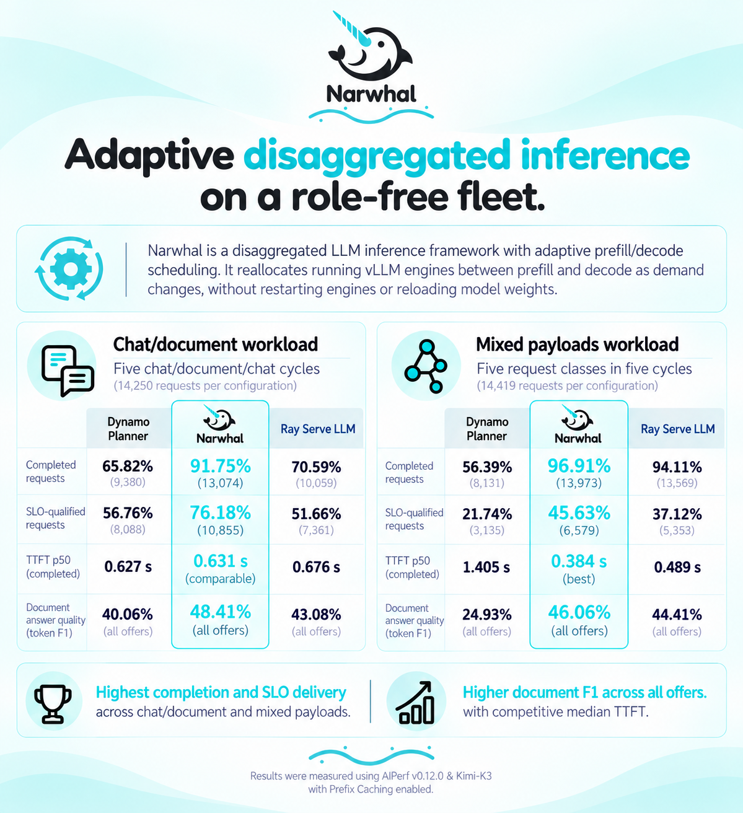

  

  
  
  
  

  <a href="docs/Home.md">Documentation</a> |
  <a href="#getting-started">Getting started</a> |
  <a href="docs/03-Deploy.md">Deployment</a> |
  <a href="docs/09-API-and-Data-Reference.md">API reference</a> |
  <a href="https://github.com/athrael-soju/Narwhal/issues">Issues</a> |
  <a href="CONTRIBUTING.md">Contributing</a>

## About

Narwhal is a disaggregated LLM inference framework with adaptive prefill/decode scheduling, which reallocates running vLLM engines between prefill and decode as demand changes while weights remain loaded on every engine.

Narwhal provides:

- Hot-swap prefill/decode role assignment across a fixed GPU fleet.
- Separate prefill and decode routing with NIXL KV transfer.
- Latency-aware admission and placement using measured per-engine profiles.
- Streaming and non-streaming completion and chat APIs, including function tools and reasoning output where supported by the engine and model.
- Request deadlines, disconnect cancellation, bounded queues and optional retries.
- Engine health checks, transfer validation and warm-standby router failover.
- Prometheus metrics, request journals and a Grafana dashboard.

## Architecture

Each engine can execute both prefill and decode. The controller assigns roles using request demand, resident work and engine profiles, with configurable role floors, cooldowns and health checks. Role changes affect new request placement; existing requests remain tracked until completion.

See [Core concepts](docs/02-Core-Concepts.md) for request flow and scheduling, and [Configuration](docs/07-Configuration.md) for controller settings.

## Benchmark snapshot

The infographic compares Narwhal, Dynamo Planner and Ray Serve LLM on two Kimi-K3 workloads measured with AlPerf v0.12.0 and prefix caching enabled.

## Getting started

Start with [Deploy a fleet](docs/03-Deploy.md) from your management workstation and fresh checkout. Use the supplied private management access and inventory to open shells on the designated router and engine hosts; the guide places installation on those hosts and GPU checks on the engine hosts. The workstation needs Git and access tooling; its hardware describes only that workstation.

## GPU deployment

Narwhal supports vLLM with NIXL (`kv_both`) when every engine serves one model through a compatible KV layout and transfer topology. Operators provision and launch the engines, record the running contract in the generic fleet configuration, then collect profiles, preflight results and [deployment-load evidence](docs/06-Measure.md) for that exact hardware and tensor-parallel shape. Follow the [deployment guide](docs/03-Deploy.md) to bind the running fleet to Narwhal.

## Documentation

- [Architecture and scheduling](docs/02-Core-Concepts.md)
- [Fleet configuration](docs/07-Configuration.md)
- [API compatibility and limits](docs/09-API-and-Data-Reference.md#response-compatibility)
- [Fleet measurement](docs/06-Measure.md)
- [Ingress, monitoring and maintenance](docs/04-Operate.md)
- [Troubleshooting](docs/05-Troubleshoot.md)

## Contributing

[Contributing](CONTRIBUTING.md) covers checkout setup, local checks and the pull request flow. The optional [CPU walkthrough](docs/01-Get-Started.md) exercises the local request path with fixture timings; fleet acceptance uses the real-engine deployment gates. Participation follows the [code of conduct](CODE_OF_CONDUCT.md), and the [security policy](SECURITY.md) covers vulnerability reports.

## Attribution and citation

Narwhal's scheduling algorithms derive from [Arrow: Adaptive Scheduling Mechanisms for Disaggregated LLM Inference Architecture](https://arxiv.org/abs/2505.11916) by Wu et al. (2025). Cite Arrow for those algorithms and Narwhal for this software. [CITATION.cff](CITATION.cff) contains both references.

License: [Apache-2.0](LICENSE).
