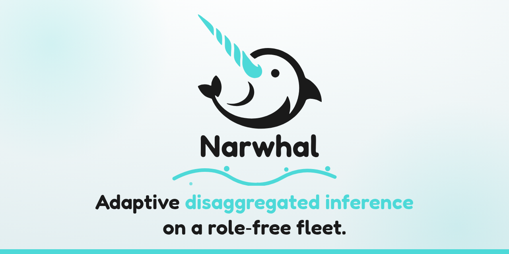

  

  
  
  
  

  <a href="https://athrael-soju.github.io/Narwhal/">Documentation</a> |
  <a href="docs/Deploy.md">Deployment</a> |
  <a href="docs/HTTP-API.md">API reference</a> |
  <a href="https://github.com/athrael-soju/Narwhal/issues">Issues</a> |
  <a href="CONTRIBUTING.md">Contributing</a>

## About

Narwhal is a disaggregated LLM inference framework with adaptive prefill/decode scheduling, which reallocates running vLLM engines between prefill and decode as demand changes while weights remain loaded on every engine.

Narwhal provides:

- Hot-swap prefill/decode role assignment across a fixed GPU fleet.
- Separate prefill and decode routing with NIXL KV transfer.
- Latency-aware admission and placement using measured per-engine profiles.
- Streaming and non-streaming completion and chat APIs, including function tools and reasoning output where supported by the engine and model.
- Request deadlines, disconnect cancellation, bounded queues and optional retries.
- Engine health checks, transfer validation and warm-standby router failover.
- Prometheus metrics, request journals and a Grafana dashboard.

## Architecture

Each engine can execute both prefill and decode. The controller assigns roles using request demand, resident work and engine profiles, with configurable role floors, cooldowns and health checks. Role changes affect new request placement; existing requests remain tracked until completion.

See [Core concepts](docs/Core-Concepts.md) for request flow and scheduling, and [Configuration](docs/Configuration.md) for controller settings.

## Benchmark snapshot

The infographic compares Narwhal, Dynamo Planner and Ray Serve LLM on two Kimi-K3 workloads measured with AlPerf v0.12.0 and prefix caching enabled.

## Deploy a fleet

Follow [Deploy a fleet](docs/Deploy.md) from your management workstation. The guide derives deployment configuration from your private `.env` and host inspection to prepare the remote router and GPU engine hosts, launch vLLM with NIXL, and verify a model completion through Narwhal. Measure the workload through the private SSH route, reconcile the results, then inspect the running fleet through Prometheus and Grafana.

## Documentation

- [Architecture and scheduling](docs/Core-Concepts.md)
- [Fleet configuration](docs/Configuration.md)
- [API compatibility and limits](docs/HTTP-API.md#response-compatibility)
- [Fleet measurement](docs/Measure.md)
- [Ingress, monitoring and maintenance](docs/Operate.md)
- [Troubleshooting](docs/Troubleshoot.md)

## Contributing

[Contributing](CONTRIBUTING.md) covers checkout setup, local checks and the pull request flow. Participation follows the [code of conduct](CODE_OF_CONDUCT.md), and the [security policy](SECURITY.md) covers vulnerability reports.

## Attribution and citation

Narwhal's scheduling algorithms derive from [Arrow: Adaptive Scheduling Mechanisms for Disaggregated LLM Inference Architecture](https://arxiv.org/abs/2505.11916) by Wu et al. (2025). Cite Arrow for those algorithms and Narwhal for this software. [CITATION.cff](CITATION.cff) contains both references.

License: [Apache-2.0](LICENSE).
