# Architectures

A serving fleet has two decisions to make: which engines take prefill and which take decode, and what a change to that assignment costs. Four designs settle these differently, and Narwhal implements the fourth. *The Price of Order in Disaggregated Inference* measures all four on one fleet with one trace. In the figures prefill is navy and decode is olive.

## The price of a move

In aggregated serving the two phases share a batch, so a long prefill stalls every decode behind it, and attainment degrades as the rate rises. Static disaggregation removes the interference but fixes the ratio, and production traces shift their phase mix minute to minute (Arrow §3.1), so a fixed ratio spends most of a moving trace off its optimum. A fleet serving such traffic has to move its split, and then the designs compare on a single term: what one move costs. Cold-swap pays minutes of offline capacity per move and earns the downtime back only when the workload shifts slowly. Hot-swap attaches the role to the request (Arrow §5.2), so changing the assignment is a relabel, and Narwhal's design pays its price elsewhere: in an engine contract and a control loop someone has to tune.

## Aggregated (colocated)

*Fig. 1 - one pool of identical replicas. Each node runs prefill and decode against the same compute and HBM.*

Every instance schedules both phases into one batch, so a chunked long prefill stalls the decode steps sharing that batch. SLO attainment degrades monotonically with the offered rate and collapses under sustained pressure, with the misses concentrated in the prefill-heavy stretches. The design operates without a scheduler, a fabric, or an engine contract, and that simplicity is its one advantage.

## Static disaggregated

*Fig. 2 - a fixed 2:2 split with no runtime controller. On this design the ratio matches one workload: the one it was sized for.*

Prefill and decode run in separate pools, the ratio set at deploy time, and each request's KV crosses the fabric between them. The two sides scale differently, prefill compute-bound and decode memory-bound, so the ratio a fleet sets fits the mix it was sized for and no other. On a stationary trace the well-sized pin matches or beats the designs that move, because it pays no adaptation overhead. Once the mix moves, overload queues in the smaller phase's pool while the other pool idles. The study measured both directions of that imbalance: a prefill wall punished the pin past a measurable knee in the offered rate, and a decode flood barely cost it at any rate tested. What adaptation is worth on a given day reduces to the fraction of the day the workload spends past such knees.

## Adaptive cold-swap (drain-and-reprovision)

*Fig. 3 - drain, teardown, reboot. Health checks gate the node's return to service.*

A planner resizes the pools, and a role change takes the instance through drain, teardown and reboot under the new role. §3.2 of the Arrow paper characterizes these transitions at minutes each. Because the moving capacity stays offline through each one, a move recovers its downtime only when the workload's phases last much longer than the move. Traffic whose optimum shifts faster gets each correction after the regime that demanded it has ended, and the adaptive arm scores below a pin. Stock engines suffice, since no instance changes role while it serves.

## Adaptive hot-swap (this project)

*Fig. 4 - the pool boundary moves at second scale as the mix shifts, and the weights stay resident throughout.*

Every engine can serve either phase: instances are stateless, and any peer can receive a request's KV (Arrow §5.2). A role is a label the scheduler rewrites, so a re-split costs one label write plus the KV handoff the affected requests already pay. No capacity goes offline, and the split follows a moving optimum in seconds. On a stationary trace the machinery costs a small overhead against the best pin, and the damping knobs recover most of it.

---

*The Price of Order in Disaggregated Inference* reports the measured comparison: all four designs on the same fleet, trace and build, pooled over two seeded walks, with the two scoring conventions and each run's configuration. The Arrow paper supplies the drain-and-reprovision characterization, where it motivates stateless instances. [Benchmarking](Benchmarking.md) explains how to measure the comparison on your own fleet.
