# Core concepts

Narwhal reallocates loaded, dual-capability engines between prefill and decode by changing their scheduler role labels.

## The engine contract

One Narwhal fleet serves one model. Every engine must:

- expose the selected inference-engine dialect;
- produce and consume compatible KV cache;
- transfer KV to every eligible peer;
- provide a measured prefill and decode profile;
- match the declared runtime contract during preflight and lifecycle readmission.

For vLLM engines with effective `kv_both` behaviour, the attestation sidecar binds the image, NIXL connector, runtime features and process start to each engine so `narwhal-check` can verify the process before moving KV through the configured ring or mesh.

## The request path

1. The router accepts an OpenAI-compatible completion request.
2. Global admission assigns an open seat; when every seat is occupied, it queues the request in the bounded FIFO against the original deadline and returns a retryable refusal once the queue reaches its configured limit.
3. Narwhal counts the prompt tokens and prices candidate prefill engines from their measured curves and current resident work.
4. The selected prefill engine processes the prompt and returns a typed producer-owned KV handoff.
5. Narwhal selects a decode engine, keeping the request local on the prefill engine or attaching its handoff to a peer.
6. Decode tokens stream to the client while Narwhal tracks resident work and token timing.
7. The request journal records timing, placement, retries, transfer, admission, and outcome.

Predictive admission returns a retryable response before dispatch when the cheapest available prefill path projects TTFT over the request budget.

## Fleet layouts

| Layout               | Engine roles                                             | Reallocation cost                                                  |
| -------------------- | -------------------------------------------------------- | ------------------------------------------------------------------ |
| Aggregated           | Every engine serves both phases.                         | Roles stay fixed; prefill and decode contend inside each engine.   |
| Static disaggregated | Prefill and decode use fixed pools.                      | Changing the split requires manual pool reconfiguration.           |
| Adaptive cold-swap   | The pools move by draining and relaunching engines.      | Restart drains capacity through weight loading and checks.         |
| Adaptive hot-swap    | Dual-role engines form logical prefill and decode pools. | The scheduler changes a label while weights remain resident.       |

### Aggregated

Aggregated placement keeps KV local by running both phases on each fixed-role engine, which makes long prefills and occupied decode batches compete for the same schedule.

### Static disaggregated

Static disaggregation sends each prompt through the fixed prefill pool and transfers its KV handoff to the fixed decode pool; the sizing workload fixes that phase ratio, so request-mix shifts require an operator to reallocate engines.

### Adaptive cold-swap

Cold-swap control drains one engine, relaunches it for the target role and restores its capacity after weight loading, peer registration and health checks; the traffic shift must outlast that restart interval for the new split to repay the move.

### Adaptive hot-swap

Narwhal hot-swaps capacity by changing a dual-capability engine's scheduler role while its weights remain resident and KV paths connect every peer; cooldown, dwell, confirmations and role floors prevent brief pressure changes from moving the split.

## Reactive control

At most once every `controller.reactive.step_s`, the reactive controller compares adjacent splits by their worst projected SLO ratio and can move several engines when a phase falls below its minimum pool size.

Each valid, locally sized prefill offer joins the bounded waiting set and receives a profile-backed FIFO completion projection across the live prefill pool. A projected TTFT above `slo.ttft_s` wakes one coalesced controller evaluation between scheduled passes. The controller revalidates the live queue, considers the adjacent D-to-P split, and requires a strict improvement in the triggering request's projected service. A queue that drains before evaluation clears the trigger. An isolated prompt whose own prefill time exceeds the SLO yields equal current and candidate projections, so the move is held.

Urgent D-to-P evaluation keeps profile coverage, decode capacity, consolidation evidence and trend, role floors, health exclusions, pins, dwell, resident ownership and `flip_resident_guard`. Each wake can apply one adjacent move. Continued projected TTFT pressure can wake another guarded evaluation from the applied topology. Scheduled P-to-D control retains its cooldown and confirmation rules.

The controller consolidates at source pressure up to `shrink`, or moves decode capacity to prefill under sustained prefill pressure at or above `expand`; both paths apply the profile, safety and confirmation gates before changing the split.

`/narwhal/state` exposes each decision's retained demand, overflow and priced inputs under the [demand accounting contract](API-and-Data-Reference.md#demand-accounting).

Before moving a decode engine to prefill, the controller closes its arrival-evidence window and checks decode stability. The window closes after `controller.reactive.evidence_span_s` with `controller.reactive.evidence_min_arrivals` samples, or after `controller.reactive.evidence_max_span_s` under sparse traffic. Candidate pricing uses the larger short- or long-horizon demand estimate and includes resident requests plus output work still in prefill.

A first-token timeout or decode-recovery move restarts the consolidation evidence window, while decode expansion and emergency floor restoration can proceed under the open-window thresholds in the [role-control reference](Configuration.md#role-control).

`controller.advisory: true` runs the decision path and records the proposed split, caller, reason and advisory result while preserving the current roles.

Ordinary demand-driven role changes observe these guards:

- A pinned engine keeps its configured role.
- Moves preserve `controller.min_prefill` and `controller.min_decode` while enough healthy capacity exists.
- `controller.thresholds.cooldown_s` limits moves toward decode.
- `controller.thresholds.dwell_s` keeps a recently moved engine in its new role.
- `controller.thresholds.flip_resident_guard` holds a move toward prefill until the lightest decode donor drains to at most this many resident streams.
- Role changes update labels for new placements while resident requests retain their assignments. Lifecycle holds remove drained or recovering engines from placement.

## Decode floors and degraded fleets

When live decode capacity falls below the configured floor, each monitor pass restores one eligible engine.

When a health failure removes an engine from placement, the controller can move another eligible engine to restore the breached floor while preserving the other floor. After readmission, current demand determines the recovered engine's role.

When failures or drains empty the prefill pool, the scheduler selects an idle decode-labelled engine as the aggregate fallback. While that engine carries decode work, predictive admission returns a retryable response because the measured curves price one phase at a time. After the resident work drains, Narwhal prices the aggregate prefill placement.

## Monitoring failures

Each monitor pass runs controller, health, drain settlement, interval rollover, readmission, liveness, telemetry and handoff independently, recording a stage exception and incrementing its counters before continuing with the remaining stages.

A pass containing any stage exception increments the consecutive failure streak. At `controller.monitor_failure_limit`, the router rejects new admissions and `/ready` returns 503 with `monitoring degraded: <stage> <class>`. Resident requests continue to completion, and a standby counts the response toward its takeover threshold.

During degradation, the monitor keeps running until a fully successful pass clears the streak and reopens admission; a router restart initializes fresh counters.

## Failure and recovery

Narwhal sends prefill, decode and token counting through the data pool bounded by `serving.max_connections`, while health, suspect verification and readmission use the reserved `engine.control_connections` pool; a local pool timeout preserves the engine's breaker state.

Narwhal counts consecutive failures separately for each engine and failure class, then takes the following action when a streak reaches `recovery.eject_after`.

| Failure                                                                | Class              | Action                                      |
| ---------------------------------------------------------------------- | ------------------ | ------------------------------------------- |
| Connection error                                                       | `connection`       | Eject the engine                            |
| Transport timeout                                                      | `timeout`          | Run a health probe                          |
| First-token deadline, mid-stream silence or invalid stream termination | `stream`           | Pause new requests and probe prefill/decode |
| HTTP 408 or 429                                                        | `overload`         | Run a health probe                          |
| Other HTTP 5xx responses                                               | `inference_status` | Pause new requests and probe prefill/decode |
| Prefill response missing a readable KV handoff                         | `kv_handoff`       | Pause new requests and probe prefill/decode |

When an inference probe yields an inconclusive leg, the scheduler retains the verification hold and the monitor schedules another probe; admission sends new work to eligible peers. A successful probe clears the recorded inference failures, while a failed prefill or decode leg ejects the engine.

The liveness sweep increments a separate per-engine miss counter, clearing it on a health answer and ejecting the engine at `recovery.liveness_misses` consecutive silent sweeps.

Performance-drift and temporary-quarantine holds preserve the last eligible engine, while a confirmed failure can eject it and make readiness plus new completion requests return HTTP 503 as recovery probes continue.

The successful response path determines which failure classes clear:

| Successful response                        | Clears                                      |
| ------------------------------------------ | ------------------------------------------- |
| 4xx response other than 408 or 429         | Connection and inference-status evidence    |
| Health 200                                 | Connection, timeout, overload and liveness  |
| Prefill with an extracted handoff          | Connection, inference-status and KV-handoff |
| Decode stream reaching its terminal marker | Connection, inference-status and stream     |

When configured, the scheduler quarantines a failed engine for `recovery.failure_quarantine_s`. Candidate selection expires the hold at its deadline, while a successful health or inference check clears it earlier. A successful inference probe clears the separate inference hold.

A contracted engine must pass health, attestation, model, generation, role-permitted KV transfer, and final health before it returns to placement. Planned maintenance adds a newer-process requirement. An operator drain survives health answers, router resume, and standby takeover until readmission succeeds.

The default policy returns saturation after one prefill/decode attempt, while [bounded serving](Configuration.md#bounded-serving) can queue or retry within the original deadline and acquires fresh KV ownership for every retry.

## Durable state

During each monitor pass, the active router writes roles, ejections, lifecycle holds, inference-verification holds, consolidation risk, counters and lease ownership into a versioned handoff that `narwhal-serve --resume` applies after matching its schema and engine set to the configured fleet.

Each handoff writer atomically renames a process-unique temporary file over the destination, so concurrent writes retain the final complete rename and a failed write removes its temporary file while preserving the preceding document.

A warm standby follows the active router's handoff and accepts traffic after acquiring the shared lease; the previous holder fences itself before local lease expiry, and load balancers select the current owner through `/ready`.

The [API and data reference](API-and-Data-Reference.md) defines the state documents. [Operate Narwhal](Operate.md) covers lifecycle and failover procedures.

## References

- [Backend continuation contract](API-and-Data-Reference.md#backend-continuation-contract): producer ownership, local decode, descriptor validation and timing boundaries.
- [Configuration](Configuration.md): placement, role guards, serving limits and engine health.
- [Measure a fleet](Measure.md): profiles, transfer checks, deployment load and occupied-role canaries for the pinned backend.
- [Source responsibilities](https://github.com/athrael-soju/Narwhal/blob/main/CONTRIBUTING.md#source-responsibilities): package ownership and import constraints.
