# Core concepts

Narwhal changes the scheduler role assigned to loaded dual-capability engines, reallocating resident capacity between prefill and decode without reloading weights.

## The engine contract

A Narwhal fleet serves a single model. Every engine must satisfy the same runtime contract:

- expose the configured inference-engine dialect;
- produce and consume compatible KV cache;
- transfer KV to every eligible peer;
- provide measured prefill and decode profiles;
- pass preflight and lifecycle readmission checks against the declared runtime contract.

For vLLM engines with effective `kv_both` behaviour, the attestation sidecar binds the image, NIXL connector, runtime features, and process start to the engine. `narwhal-check` verifies that process before Narwhal transfers KV through the configured ring or mesh.

## Request path

1. The router receives an OpenAI-compatible completion request.
2. Global admission assigns an available seat. If all seats are occupied, the request enters the bounded FIFO with its original deadline. Once that queue reaches its configured limit, admission returns a retryable refusal.
3. Narwhal counts prompt tokens and prices eligible prefill engines using their measured curves plus current resident work.
4. The selected prefill engine processes the prompt and returns a typed, producer-owned KV handoff.
5. Narwhal chooses a decode engine. Decode may remain local to the prefill engine or consume the handoff on a peer.
6. Decode tokens stream to the client while Narwhal tracks resident work and token timing.
7. The request journal records admission, placement, timing, transfer, retries, and outcome.

Predictive admission can reject before dispatch. If the cheapest available prefill path projects TTFT beyond the request budget, Narwhal returns a retryable response.

## Fleet layouts

| Layout               | Engine roles                                                   | Reallocation cost                                                    |
| -------------------- | -------------------------------------------------------------- | -------------------------------------------------------------------- |
| Aggregated           | Every engine handles prefill and decode.                       | Roles remain fixed; both phases contend inside each engine.          |
| Static disaggregated | Separate fixed pools handle prefill and decode.                | Changing the split requires manual pool reconfiguration.             |
| Adaptive cold-swap   | Engines move between pools by draining and relaunching.        | Capacity disappears during draining, weight loading, and validation. |
| Adaptive hot-swap    | Dual-capability engines form logical prefill and decode pools. | The scheduler changes a role label while weights stay resident.      |

### Aggregated

Each engine performs both phases, so KV stays local. Long prefills and occupied decode batches therefore compete for the same engine schedule.

### Static disaggregated

Prompts run through the fixed prefill pool, then their KV handoffs move to the fixed decode pool. The workload used for sizing determines the phase ratio. A change in request mix requires an operator to reallocate engines.

### Adaptive cold-swap

A cold-swap drains an engine, relaunches it in the target role, reloads weights, registers peers, and completes health checks before restoring capacity. The new split only pays for itself if the traffic shift lasts longer than this restart interval.

### Adaptive hot-swap

Hot-swap changes the scheduler role of a dual-capability engine while its weights remain resident. KV paths already connect eligible peers. Cooldown, dwell, confirmation rules, and role floors stop brief pressure changes from repeatedly moving the split.

## Reactive control

The reactive controller evaluates at most once per `controller.reactive.step_s`. It compares adjacent fleet splits using the worst projected SLO ratio. A move can involve several engines when one phase has fallen below its configured minimum pool size.

Every valid, locally sized prefill offer enters the bounded waiting set. Narwhal assigns it a FIFO completion projection derived from measured profiles and the live prefill pool.

If projected TTFT exceeds `slo.ttft_s`, Narwhal schedules one coalesced controller evaluation between regular passes. At evaluation time, the controller rechecks the live queue and prices the adjacent decode-to-prefill split. It moves capacity only when that split strictly improves projected service for the request that triggered the evaluation.

A trigger disappears if the queue drains first. A single prompt whose own prefill duration already exceeds the SLO produces the same projection under the current and candidate split, so no move occurs.

Urgent decode-to-prefill evaluation still enforces profile coverage, decode capacity, consolidation evidence and trend, role floors, health exclusions, pins, dwell, resident ownership, and `flip_resident_guard`. One wake can apply one adjacent move. If projected TTFT remains high after the topology changes, the resulting state can trigger another guarded evaluation.

Scheduled prefill-to-decode moves keep their existing cooldown and confirmation requirements.

Source pressure up to `shrink` drives consolidation. Sustained prefill pressure at or above `expand` can move decode capacity into prefill. Both paths pass the same profile, safety, and confirmation gates before roles change.

`/narwhal/state` records the retained demand, overflow, and priced inputs used for each decision under the [demand accounting contract](HTTP-API.md#demand-accounting).

Before moving a decode engine into prefill, the controller closes its arrival-evidence window and checks decode stability. The window closes after `controller.reactive.evidence_span_s` once it has at least `controller.reactive.evidence_min_arrivals` samples. Under sparse traffic, it closes at `controller.reactive.evidence_max_span_s`.

Candidate pricing uses the larger of the short- and long-horizon demand estimates. That demand includes resident requests and output work whose prefill has not yet completed.

A first-token timeout or decode-recovery move restarts the consolidation evidence window. Decode expansion and emergency floor restoration may proceed under the open-window thresholds defined in the [role-control reference](Configuration.md#role-control).

With `controller.advisory: true`, Narwhal executes the full decision path but leaves roles unchanged. It records the proposed split, caller, reason, and advisory result.

Ordinary demand-driven role changes obey these guards:

- pinned engines retain their configured roles;
- moves preserve `controller.min_prefill` and `controller.min_decode` whenever enough healthy capacity remains;
- `controller.thresholds.cooldown_s` limits moves toward decode;
- `controller.thresholds.dwell_s` prevents a recently moved engine from immediately changing back;
- `controller.thresholds.flip_resident_guard` blocks a move toward prefill until the lightest decode donor has at most that many resident streams;
- role labels affect new placements only; resident requests keep their assignments;
- lifecycle holds remove draining or recovering engines from placement.

## Decode floors and degraded fleets

If live decode capacity drops below its configured floor, each monitor pass restores one eligible engine.

A health failure may remove an engine from placement. The controller can then reassign another eligible engine to repair the breached floor, provided the other role floor remains intact. After the failed engine passes readmission, current demand determines which role it receives.

If failures or drains leave no prefill-labelled engine, the scheduler can use an idle decode-labelled engine as the aggregate fallback. Predictive admission rejects new work while that engine still owns decode requests because the measured curves price one phase at a time. Once its resident decode work drains, Narwhal can price it for aggregate prefill placement.

## Monitoring failures

A monitor pass runs controller logic, health checks, drain settlement, interval rollover, readmission, liveness, telemetry, and handoff as independent stages. If one stage raises an exception, Narwhal records the stage error, increments its counters, and continues with the remaining stages.

Any pass containing a stage exception increments the consecutive monitor-failure streak. When the streak reaches `controller.monitor_failure_limit`, the router stops accepting new admissions. `/ready` returns HTTP 503 with:

`monitoring degraded: <stage> <class>`

Existing requests continue to completion. A standby counts the readiness failure toward its takeover threshold.

Monitoring continues during degradation. One fully successful pass clears the streak and reopens admission. Restarting the router starts with fresh counters.

## Failure and recovery

Prefill, decode, and token counting use the data connection pool bounded by `serving.max_connections`. Health checks, suspect verification, and readmission use the reserved `engine.control_connections` pool. A timeout while acquiring a local pool connection does not change the engine's breaker state.

Narwhal tracks consecutive failures per engine and per failure class. When a streak reaches `recovery.eject_after`, handling depends on the class:

| Failure                                                                 | Class              | Action                                      |
| ----------------------------------------------------------------------- | ------------------ | ------------------------------------------- |
| Connection error                                                        | `connection`       | Eject the engine                            |
| Transport timeout                                                       | `timeout`          | Run a health probe                          |
| First-token deadline, mid-stream silence, or invalid stream termination | `stream`           | Pause new requests and probe prefill/decode |
| HTTP 408 or 429                                                         | `overload`         | Run a health probe                          |
| Other HTTP 5xx response                                                 | `inference_status` | Pause new requests and probe prefill/decode |
| Prefill response without a readable KV handoff                          | `kv_handoff`       | Pause new requests and probe prefill/decode |

An inconclusive inference-probe leg leaves the verification hold in place. The monitor schedules another probe, while admission routes new work to eligible peers.

A successful inference probe clears recorded inference failures. A failed prefill or decode leg ejects the engine.

Liveness uses a separate per-engine miss counter. Any successful health response resets it. The engine is ejected after `recovery.liveness_misses` consecutive silent sweeps.

Performance-drift and temporary-quarantine holds will not remove the last eligible engine from service. A confirmed failure can. If that leaves the fleet unable to serve, `/ready` and new completion requests return HTTP 503 while recovery probes continue.

Successful responses clear failure evidence according to the response type:

| Successful response                        | Clears                                       |
| ------------------------------------------ | -------------------------------------------- |
| 4xx response other than 408 or 429         | Connection and inference-status evidence     |
| Health 200                                 | Connection, timeout, overload, and liveness  |
| Prefill with an extracted handoff          | Connection, inference-status, and KV-handoff |
| Decode stream reaching its terminal marker | Connection, inference-status, and stream     |

When `recovery.failure_quarantine_s` is configured, a failed engine remains quarantined until that deadline unless a successful health or inference check clears the hold first. Candidate selection expires the quarantine automatically at the deadline. A successful inference probe also clears the separate inference hold.

Before a contracted engine returns to placement, it must pass health, attestation, model, generation, role-permitted KV transfer, and final-health checks. Planned maintenance adds a newer-process requirement.

Operator drains persist across health responses, router resume, and standby takeover. Only successful readmission clears them.

The default serving policy reports saturation after one prefill/decode attempt. [Bounded serving](Configuration.md#bounded-serving) can queue or retry within the request's original deadline. Every retry acquires fresh KV ownership.

## Durable state

On every monitor pass, the active router writes a versioned handoff containing roles, ejections, lifecycle holds, inference-verification holds, consolidation risk, counters, and lease ownership.

`narwhal-serve --resume` applies that handoff only after the saved schema and engine set match the configured fleet.

Handoff writes use an atomic rename. Each writer creates a process-unique temporary file and renames it over the destination. Concurrent writers therefore leave one complete final document. If a write fails, Narwhal removes its temporary file and keeps the previous destination intact.

A warm standby follows the active router's handoff. It begins serving only after acquiring the shared lease. The previous lease holder fences itself before its local lease expires. Load balancers identify the current owner through `/ready`.

The [HTTP API reference](HTTP-API.md) defines the state documents. [Operate Narwhal](Operate.md) documents lifecycle and failover procedures.

## References

- [Backend continuation contract](HTTP-API.md#backend-continuation-contract): producer ownership, local decode, descriptor validation, and timing boundaries.
- [Configuration](Configuration.md): placement, role guards, serving limits, and engine health.
- [Measure a fleet](Measure.md): profiles, transfer checks, deployment load, and occupied-role canaries for the pinned backend.
- [Source responsibilities](https://github.com/athrael-soju/Narwhal/blob/main/CONTRIBUTING.md#source-responsibilities): package ownership and import constraints.