# Request flow and fleet topology

## Engine contract

Every engine in a fleet meets the same contract:

- Speaks the configured inference-engine dialect.
- Produces and consumes compatible key-value (KV) cache.
- Sends KV to every peer eligible to receive it.
- Has measured prefill and decode performance profiles.
- Passes preflight validation before taking traffic.
- Passes readmission checks after a hold, drain, failure, or maintenance event.

The fleet's `engine_contract` lists the [compatibility fields](../configuration/01-Fleet-Schema.md#3-engine-shape-and-compatibility-contract) that every engine must match.

### KV transfer for vLLM engines

A vLLM engine with the effective `kv_both` role transfers KV across the configured ring or mesh when three requirements hold. [Gate E](../deploy/05-Attest.md#capturing-the-attestation-inputs) captures the attestation inputs from the live process. The attestation sidecar binds the process to its image, NIXL connector and runtime features, and [`narwhal-check`](../cli/Check.md) validates the attested process.

## How a request executes

A completion request passes through these stages:

1. The request takes a seat under the [router in-flight limit](../configuration/02-Serving-and-Role-Control.md#in-flight-limit).
2. The router prices each eligible prefill engine from its profile over the prompt and its resident prefill requests, with [prefix-cache pricing](../configuration/02-Serving-and-Role-Control.md#51-prefix-cache-pricing) for cached prefixes.
3. With the default `serving.admission` of `predictive`, the router rejects a request that fails the projected time to first token (TTFT) check on the cheapest available prefill path or the [decode admission check](../configuration/02-Serving-and-Role-Control.md#decode-admission-check).
4. The chosen prefill engine holds the prompt KV as the producer and returns a typed KV handoff.
5. An eligible engine consumes the handoff and runs decode.
6. Tokens stream to the client.
7. The request journal records admission, placement, retries, transfers, timing, and the final outcome.

When every seat is occupied, `serving.queue_capacity` sets the outcome. With a positive capacity and space in the queue, the request waits in a bounded FIFO queue within `serving.queue_timeout_s` and its original deadline. A full queue, or the default capacity of `0`, gives a retryable refusal. [Queue waits](../configuration/02-Serving-and-Role-Control.md#queue-waits) gives each wait's bound and response.

A [retry](../configuration/02-Serving-and-Role-Control.md#42-waiting-phase-concurrency-and-retries) reruns prefill and decode with a fresh KV handoff.

## Fleet topology

A fleet's topology sets how its engines divide prefill and decode work.

### Aggregated serving

Every engine does both prefill and decode, with local KV. Long prefills share a scheduler with decode batches.

### Static disaggregation

A fixed prefill pool and a fixed decode pool serve requests. An operator changes pool membership by hand.

### Adaptive cold-swap

Engines change pools by draining and relaunching. Capacity arrives after restart, weight load, and validation.

A cold-swap move runs these steps:

1. Drain the engine.
2. Relaunch it in the new role.
3. Reload its weights.
4. Register its transfer peers.
5. Pass health validation.

Use cold-swap for traffic shifts longer than this sequence.

### Adaptive hot-swap

Dual-capability engines form logical prefill and decode pools, and their weights stay loaded.

Hot-swap changes the scheduler role of an eligible dual-capability engine in place.

[Role-change guards](02-Role-Control.md#guards-on-role-changes) limit role changes:

- a cooldown
- a minimum dwell time
- confirmation rules
- minimum role floors
- a check on resident work
- exclusion of unhealthy engines
- exclusion of engines in a lifecycle event
