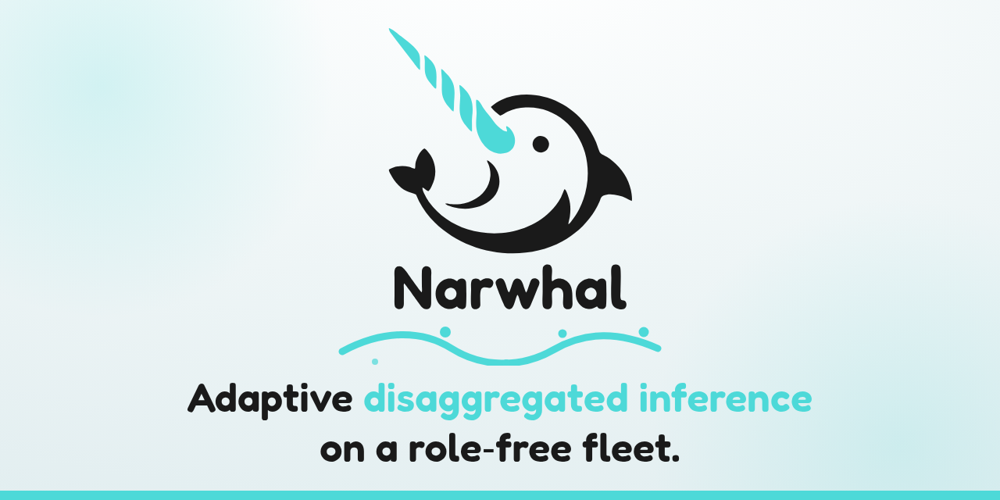

# Narwhal documentation

Narwhal runs disaggregated LLM inference and [reassigns prefill and decode roles](Core-Concepts.md) as demand changes. Model weights stay loaded during role changes.

  

## Tasks

| Goal                                                                                           | Guide                                     |
| ---------------------------------------------------------------------------------------------- | ----------------------------------------- |
| Install the Narwhal commands from PyPI and check their version                                 | [Install from PyPI](Install-from-PyPI.md) |
| Run a local NVIDIA GPU fleet on Ubuntu or WSL2                                                 | [Narwhal dev](Dev-Runtime.md)             |
| Bring up a new fleet and verify request routing                                                | [Deploy a fleet](Deploy.md)               |
| Profile the fleet, select measurement ranges, calibrate SLOs, and measure a target workload    | [Measure a fleet](Measure.md)             |
| Export metrics to Prometheus and inspect the fleet in Grafana                                  | [Set up observability](Observability.md)  |
| Manage ingress, routers, engines, and software upgrades                                        | [Operate Narwhal](Operate.md)             |
| Diagnose overload, engine failures, or router failures starting from the first visible symptom | [Troubleshoot a fleet](Troubleshoot.md)   |

## Concepts and reference

- [Core concepts](Core-Concepts.md): the contracts that govern engines, request placement, role control, and fleet state.
- [Configuration](Configuration.md): fleet configuration fields, environment inputs, and their defaults.
- [CLI reference](CLI-Reference.md): available commands and options, including command exit behaviour.
- [HTTP API reference](HTTP-API.md): completion, inspection, and lifecycle endpoints.
- [Telemetry and artifact reference](Telemetry-and-Artifacts.md): journals, profiles, metrics, and persisted contract versions.

## Development

[Contributing](https://github.com/athrael-soju/Narwhal/blob/main/CONTRIBUTING.md) covers development environment setup, the local test workflow, and the pull request process.
