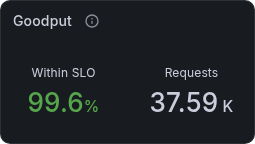
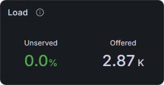
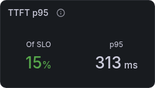
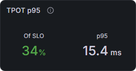
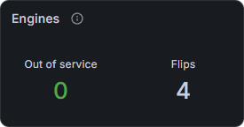

# Reading the dashboard

The **Narwhal Orchestrator** dashboard reads from top to bottom. The headline row shows whether requests meet their SLOs. The engine and pool panels below it show how the fleet carries the load, and the latency and pressure panels at the bottom show where delays and failures start.

Open the dashboard through the tunnel in [Accessing the dashboard from a workstation](02-Access.md#accessing-the-dashboard-from-a-workstation).

## Selectors

The **Router** selector scopes every panel built from router metrics. **Engine detail** narrows the out-of-service count, the engine table and **Engine role history** to the engines you pick. Both selectors default to All.

## Headline row

Each headline block leads with a status value coloured against its target.

Goodput, Load, both p95 blocks and the flip count cover the displayed interval. The out-of-service count, admission and alerts show the current state.

**Goodput** shows how many ended requests met both the TTFT and TPOT SLOs, as a share and as a count. The share's total is every completed, failed, refused, rejected, expired and cancelled request.

**Load** shows the **Unserved** share beside the number of requests clients **Offered**. Unserved counts refused, rejected, failed and expired requests over the same total.

**TTFT p95** and **TPOT p95** give the 95th-percentile time to first token and time per output token, as a share of the SLO and as a time.

**Engines** counts engines in an [out-of-service state](#engine-states) and the role flips in the interval. **Router** shows whether the router admits traffic and how many Narwhal alerts are firing.

Status colours:

| Value | Green | Amber | Red |
| --- | --- | --- | --- |
| Within SLO | 95% or more | 90% to 95% | below 90% |
| Unserved | below 1% | 1% to 5% | 5% or more |
| Of SLO | below 80% | 80% to 100% | 100% or more |
| Out of service | 0 | | 1 or more |
| Admission | Ready | | Not ready or Offline |
| Alerts | 0 | | 1 or more |

## Engines and engine role history

The engine table shows each engine's current role, state and load. **Engine role history** beside it lists the same engines in the same order and shows how their roles changed over the interval.

**Role** and **State** tell you what the engine does and whether it takes placements. The **Resident** and **vLLM running** bars scale to the busiest engine, and a short bar marks a lightly loaded engine.

| Column | Shows |
| --- | --- |
| Engine | Engine ID (`iid`) |
| Role | Current pool assignment: Prefill, Decode or Colocated |
| State | The most serious [engine state](#engine-states) |
| Resident | Narwhal requests currently on the engine |
| vLLM running | Requests vLLM reports as running |
| KV cache | vLLM KV cache use, amber from 80% and red from 95% |
| Prefix hits | Share of prompt tokens served from the engine's prefix cache |
| Tokens/s | Prompt tokens prefilled per second on prefill engines, and output tokens per second on decode and colocated engines |

In **Engine role history**, teal is Prefill, blue is Decode and grey-violet is Colocated. A change between roles is a role flip. While an engine is out of service, its row takes the colour of its **State** cell in the engine table.

## Request outcomes and fleet events

**Request outcomes** shows what happened to client requests, and **Fleet events** shows which alerts fired at the same time.

In a healthy fleet, **completed** follows **offered** and the other series stay near zero. When a gap opens between those two lines, the series that rises inside it shows where the missing requests went:

| Series | Requests per second |
| --- | --- |
| offered | Original completion requests received, including early refusals |
| completed | Requests completed successfully |
| failed | Requests that ended in an error |
| refused (predictive) | Requests predictive admission refused for a projected TTFT or decode SLO miss |
| rejected (capacity) | Requests rejected by authentication or a concurrency limit |
| expired | Requests terminated by their admission or total deadline |
| cancelled | Requests their client abandoned before completion |
| invalid | Malformed or unsupported client requests rejected before dispatch |

When a Narwhal alert starts firing, a red (page) or amber (warning) dashed marker appears on **Request outcomes**. Hover over a marker for its severity and, for `NarwhalEngineDown`, the engine.

**Fleet events** gives each alert its own row, with one row per engine for `NarwhalEngineDown`. A red or amber bar marks the time the alert fires.

## Pool assignments

**Pool assignments** shows how many engines serve each phase over time.

The teal line counts prefill engines, the blue line counts decode engines and the red line counts engines the breaker ejected. Mirrored steps in the teal and blue lines mark a role flip.

## Latency and token throughput

These panels show how long requests take and how much work the engines complete.

**Time to first token** plots the p50, p95 and p99 time from router arrival to the end of prefill. **Time per output token** plots the same percentiles of each ended request's average time between output tokens after prefill.

Both panels draw the selected router's SLO as a line. When p95 crosses it, more than 5% of requests in that window missed the SLO.

**Token throughput** plots two rates: prompt tokens the engines prefill (**Prefill/s**) and output tokens the router observes (**Decode/s**). Prefill/s counts vLLM's `local_compute` and `local_cache_hit` prompt tokens, or `vllm:prompt_tokens_total` on engines that report only the total.

## Pool pressure, request waiting time and retries

These panels show pressure building before clients feel it.

**Pool pressure** plots each pool's load as a fraction of its SLO target, and the amber line at 1 marks the target. When a pool's load stays at or above `controller.thresholds.expand` (default 1.0), [reactive role control](../concepts/02-Role-Control.md#expansion-and-consolidation) can move an engine into that pool.

**Request waiting time** plots two p95 times: how long a request waits for admission and dispatch (**queue wait p95**) and how long it holds an admission seat (**seat time p95**).

**Retries and early exits** plots retry attempts per second next to the requests per second that ended before [input sizing](../http-api/03-Backend-and-Failures.md#input-sizing).

## Engine states

The **State** column shows the most serious state that applies to an engine. The states run from least to most serious:

| State | Meaning | Service |
| --- | --- | --- |
| Serving | Normal operation | In service |
| Switching | The engine finishes requests from its previous role after a flip | In service |
| Backlogged | vLLM reports waiting requests | In service |
| Probation | Placement ranks the engine lower after latency drift | In service |
| Verifying | A breaker verification probe is in flight, and an inference probe holds the engine out of placement while other engines cover its role | In service |
| Draining | An operator drain holds the engine out of placement | Out of service |
| Ejected | The breaker removed the engine from placement | Out of service |
| Validating | Readmission checks run against the engine | Out of service |
| Blocked | The engine waits for an operator, for example after a failed readmission check or during a whole-wave restart hold | Out of service |
| Unreachable | The engine's metrics endpoint fails to answer Prometheus | Out of service |
| Restarting | The engine is unreachable while a drain holds it | Out of service |

