# Reading the dashboard

The **Narwhal Orchestrator** dashboard reads from top to bottom. The headline row shows whether requests meet their SLOs. The engine, outcome and pool panels below it show how the fleet carries the load and why requests drop. The latency, admission, queue, retry and router event-loop panels at the bottom show where delays and failures start.

Open the dashboard through the tunnel in [Accessing the dashboard from a workstation](02-Access.md#accessing-the-dashboard-from-a-workstation).

## Selectors

The **Router** selector scopes every panel built from router metrics. **Engine detail** narrows the engine table, **Engine role history** and **Expired KV by producer** to the engines you pick. Both selectors default to All.

## Colours

Each colour keeps one meaning on every panel. In the headline row, cells that judge the service fill green, yellow or red, and count cells show plain values.

These colours mark the engine roles, the phases and completed work on every panel:

| Colour      | Hex                  | Meaning                                                                       |
| ----------- | -------------------- | ----------------------------------------------------------------------------- |
| Teal        | `#299E97`            | Prefill role, pool and phase, **Prefill/s** and TTFT p95                      |
| Teal shades | `#1A847E`, `#49B7B0` | TTFT p50 and p99                                                              |
| Blue        | `#336B9E`            | Decode role, pool and phase, **Decode/s** and TPOT p95                        |
| Blue shades | `#21537E`, `#69A2D8` | TPOT p50 and p99                                                              |
| Violet      | `#8C84CE`            | Colocated role                                                                |
| Green       | `#56A64B`            | Serving, completed, KV cache below 80% and headline values within their limit |

The engine table and **Engine role history** colour engine states:

| Colour       | Hex       | Meaning                                                |
| ------------ | --------- | ------------------------------------------------------ |
| Amber        | `#C8963E` | Backlogged, Probation, Verifying and KV cache from 80% |
| Burnt orange | `#E0752D` | Quarantined                                            |
| Red          | `#D44A3A` | Ejected, Unreachable and KV cache from 95%             |
| Maroon       | `#A11D1D` | Blocked                                                |
| Magenta      | `#9E4AA4` | Switching and Validating                               |
| Grey         | `#8E9196` | Draining, Restarting, N/A and the engine table bars    |

The charts and the headline row colour request outcomes, alerts, status values and the router's own measurements:

| Colour       | Hex       | Meaning                                                                                                      |
| ------------ | --------- | ------------------------------------------------------------------------------------------------------------ |
| Light blue   | `#5794F2` | offered                                                                                                      |
| Pale blue    | `#8AB8FF` | ended before sizing                                                                                          |
| Light yellow | `#FFEE52` | cancelled                                                                                                    |
| Yellow       | `#F2CC0C` | refused, retries denied, warnings, the pool target, the in-flight limit and headline values near their limit |
| Orange       | `#FF9830` | rejected                                                                                                     |
| Pink         | `#FF7383` | invalid                                                                                                      |
| Red          | `#D44A3A` | failed, pages, SLO lines, ejected engines and headline values past their limit                               |
| Dark red     | `#C4162A` | expired requests and expired KV                                                                              |
| Purple       | `#B877D9` | retry attempts and retry credits                                                                             |
| Dark purple  | `#A352CC` | admission queue and wait, the admission and queue attempt phases, and event-loop lag                         |
| Light purple | `#CA95E5` | seat time, requests in flight and event-loop busy share                                                      |

## Headline row

The **Requests** and **Latency** tables summarise the displayed interval. **Router** shows whether the router admits traffic and how many Narwhal alerts are firing now.

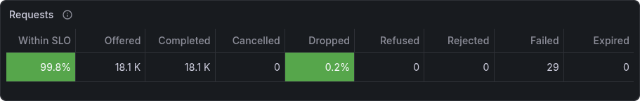

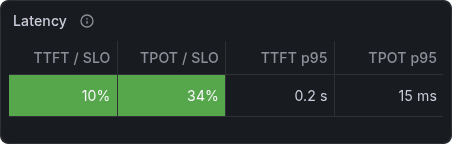

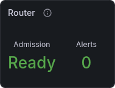

| Requests column                    | Shows                                                                          |
| ---------------------------------- | ------------------------------------------------------------------------------ |
| Within SLO                         | Share of ended requests that met both the TTFT and TPOT SLOs                   |
| Offered, Completed, Cancelled      | Requests clients sent, requests completed and requests their clients abandoned |
| Dropped                            | Share of ended requests that were refused, rejected, failed or expired         |
| Refused, Rejected, Failed, Expired | The count of each dropped outcome                                              |

Ended requests are completed, failed, refused, rejected, expired and cancelled requests.

| Latency column         | Shows                                                                                                   |
| ---------------------- | ------------------------------------------------------------------------------------------------------- |
| TTFT / SLO, TPOT / SLO | 95th-percentile time to first token and time per output token as a share of the SLO the router ran with |
| TTFT p95, TPOT p95     | The same percentiles as times                                                                           |

Status colours:

| Value                     | Green       | Yellow      | Red                  |
| ------------------------- | ----------- | ----------- | -------------------- |
| Within SLO                | 95% or more | 90% to 95%  | below 90%            |
| Dropped                   | below 1%    | 1% to 5%    | 5% or more           |
| TTFT / SLO and TPOT / SLO | below 80%   | 80% to 100% | 100% or more         |
| Admission                 | Ready       |             | Not ready or Offline |
| Alerts                    | 0           |             | 1 or more            |

## Engines and engine role history

The engine table shows each engine's current role, state and load. **Engine role history** beside it lists the same engines in the same order and shows how their roles changed over the interval.

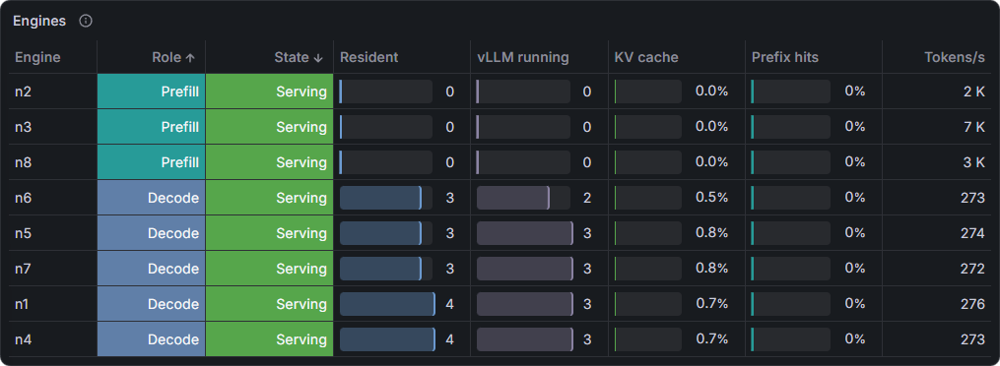

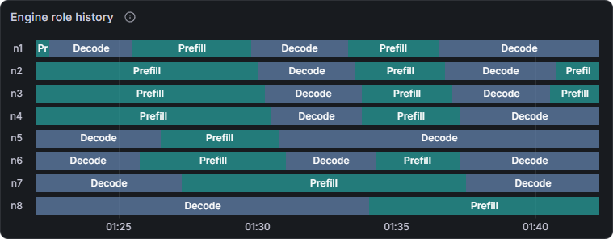

**Role** and **State** tell you what the engine does and whether it takes placements. The **Resident** and **vLLM running** bars scale to the busiest engine.

| Column       | Shows                                                                                                               |
| ------------ | ------------------------------------------------------------------------------------------------------------------- |
| Engine       | Engine ID (`iid`)                                                                                                   |
| Role         | Current pool assignment: Prefill, Decode or Colocated                                                               |
| State        | The most serious [engine state](#engine-states)                                                                     |
| Resident     | Narwhal requests currently on the engine                                                                            |
| vLLM running | Requests vLLM reports as running                                                                                    |
| KV cache     | vLLM KV cache use, amber from 80% and red from 95%                                                                  |
| Prefix hits  | Share of prompt tokens served from the engine's prefix cache                                                        |
| Tokens/s     | Prompt tokens prefilled per second on prefill engines, and output tokens per second on decode and colocated engines |

In **Engine role history**, teal is Prefill, blue is Decode and violet is Colocated. A change between roles is a role flip. While an engine is out of service, its row takes the colour of its **State** cell in the engine table.

## Request outcomes and fleet events

**Request outcomes** shows what happened to client requests, and **Fleet events** shows which alerts fired at the same time.

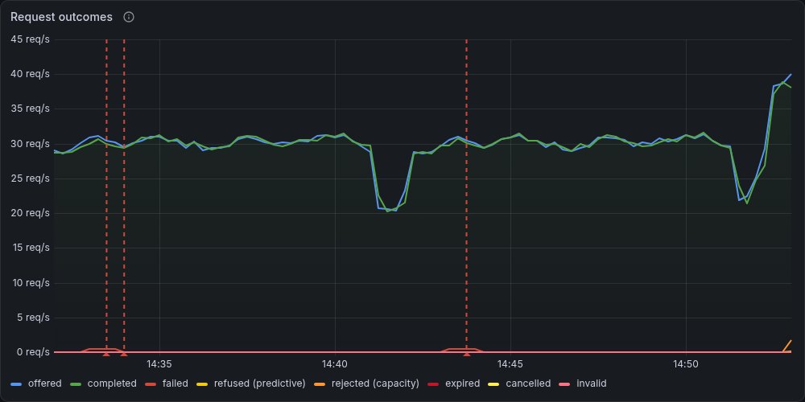

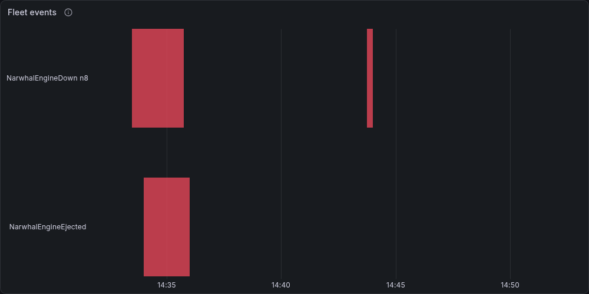

In a healthy fleet, **completed** follows **offered** and the other series stay near zero. When a gap opens between those two lines, the series that rises inside it shows where the missing requests went:

| Series               | Requests per second                                                           |
| -------------------- | ----------------------------------------------------------------------------- |
| offered              | Original completion requests received, including early refusals               |
| completed            | Requests completed successfully                                               |
| failed               | Requests that ended in an error                                               |
| refused (predictive) | Requests predictive admission refused for a projected TTFT or decode SLO miss |
| rejected (capacity)  | Requests refused with HTTP 429 for capacity or HTTP 503 for router readiness  |
| expired              | Requests terminated by their admission or total deadline                      |
| cancelled            | Requests their client abandoned before completion                             |
| invalid              | Malformed or unsupported client requests rejected before dispatch             |

When a Narwhal alert starts firing, a red (page) or yellow (warning) dashed marker appears on **Request outcomes**. Hover over a marker for its severity and, for `NarwhalEngineDown`, the engine.

**Fleet events** gives each alert its own row, with one row per engine for `NarwhalEngineDown`. A red or yellow bar marks the time the alert fires.

## Drop reasons, failed attempts and expired KV

The row under **Request outcomes** breaks its drop series down by request outcome, by attempt and by producer engine, reading left to right.

**Dropped requests by reason** shows one bar for each outcome and reason that dropped at least one request during the displayed interval. Each bar counts `increase()` over the interval of `narwhal_refused_total` by `cause`, or of `narwhal_rejected_total`, `narwhal_failed_total` or `narwhal_expired_total` by `reason`, and takes its outcome's colour from **Request outcomes**. Reasons with no requests in the interval have no bar. [Outcome reasons](../telemetry/01-Journal.md#outcome-reasons) gives the condition behind each reason.

**Failed attempts by reason** counts `narwhal_attempt_failures_total` over the displayed interval, by the [phase](../telemetry/01-Journal.md#attempt-failures) the attempt reached and its reason. Dark purple bars are failures in the `admission` or `queue` phase, teal bars in `prefill` and blue bars in `decode`. A failed attempt ends its request unless the router schedules a retry, so compare these bars with **completed after retry** on **Retries and early exits**.

**Expired KV by producer** plots, per engine, the rate of vLLM's NIXL connector counter `vllm:nixl_num_kv_expired_reqs_total`: requests whose KV expired on that engine. vLLM records the counter on the producer side of a KV transfer, which is the prefill engine. Engines that do not export the counter have no line. Hover over a line for the engine ID.

## Pool assignments

**Pool assignments** shows how many engines serve each phase over time.

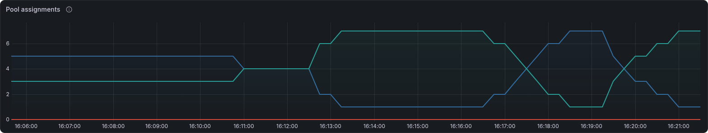

The teal line counts prefill engines, the blue line counts decode engines and the red line counts engines the breaker ejected. Mirrored steps in the teal and blue lines mark a role flip.

## Latency and token throughput

These panels show how long requests take and how much work the engines complete.

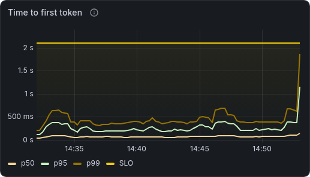

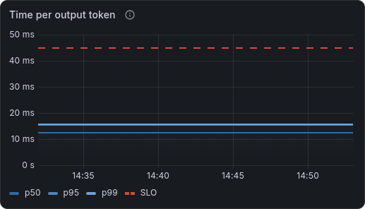

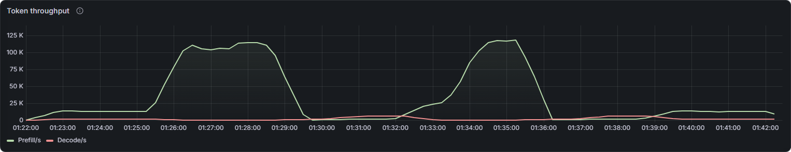

**Time to first token** plots the p50, p95 and p99 time from router arrival to the end of prefill. **Time per output token** plots the same percentiles of each ended request's average time between output tokens after prefill.

Both panels draw the selected router's SLO as a dashed red line. When p95 crosses it, more than 5% of requests in that window missed the SLO.

**Token throughput** plots two rates: prompt tokens the engines prefill (**Prefill/s**) and output tokens the router observes (**Decode/s**). Prefill/s counts vLLM's `local_compute` and `local_cache_hit` prompt tokens, or `vllm:prompt_tokens_total` on engines that report only the total.

## Pool pressure, admission and queue depth

These panels show pool load, admission seats and the requests waiting at each queue stage.

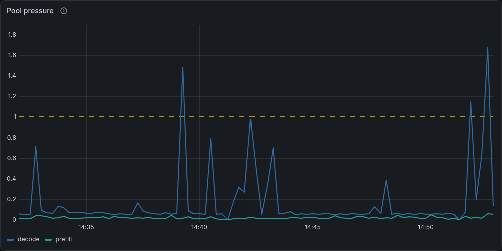

**Pool pressure** plots each pool's load as a fraction of its SLO target, and the dashed yellow line at 1 marks the target. When a pool's load stays at or above `controller.thresholds.expand` (default 1.0), [reactive role control](../concepts/02-Role-Control.md#expansion-and-consolidation) can move an engine into that pool.

**Admission in-flight** plots the requests holding an admission seat (`narwhal_admission_inflight`) against the router [in-flight limit](../configuration/02-Serving-and-Role-Control.md#in-flight-limit) (`narwhal_admission_inflight_limit`), drawn as a dashed yellow line. While in-flight sits at the limit, further requests wait in the admission queue, up to `serving.queue_capacity`. Beyond that, the router rejects each new request with HTTP 429 and reason `inflight_limit`.

**Queue depth** plots the requests waiting at each stage:

| Series    | Metric                    | Requests waiting                                                                          |
| --------- | ------------------------- | ----------------------------------------------------------------------------------------- |
| admission | `narwhal_queued`          | For an admission seat                                                                     |
| prefill   | `narwhal_waiting_prefill` | For a prefill [engine seat](../configuration/02-Serving-and-Role-Control.md#engine-seats) |
| decode    | `narwhal_waiting_decode`  | For a decode engine seat                                                                  |

When the prefill or decode line rises, no engine of that phase has a free seat. When the admission line rises while **Admission in-flight** sits at its limit, every admission seat is taken.

## Request waiting time and retries

These panels show how long requests wait and how the router retries failed attempts.

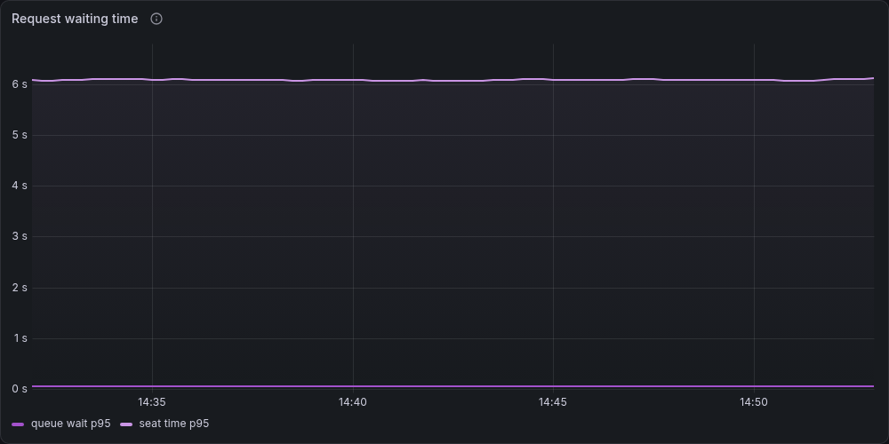

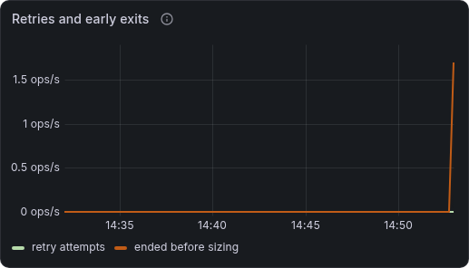

**Request waiting time** plots the p95 wait at each queue stage from `narwhal_queue_wait_seconds`, split by its `stage` label: **admission wait p95** for an admission seat, and **prefill seat wait p95** and **decode seat wait p95** for an engine seat. **seat time p95** shows how long a request holds an admission seat. A request whose admission wait reaches `serving.queue_timeout_s` expires with reason `queue_timeout`.

**Retries and early exits** plots these rates:

| Series                | Per second                                                                                     |
| --------------------- | ---------------------------------------------------------------------------------------------- |
| retry attempts        | Additional prefill attempts after an original attempt failed                                   |
| retries denied        | Retries the shared retry quota denied, each ending a request the retry policy would retry      |
| completed after retry | Requests completed by an attempt after the first                                               |
| ended before sizing   | Requests that ended before [input sizing](../http-api/03-Backend-and-Failures.md#input-sizing) |

**Retry credits** plots `narwhal_retry_credits`, the credits available for new retries. The pool starts at `serving.retry_budget`, each retry spends one credit when it dispatches, and each successful original request adds `serving.retry_replenish` up to the starting size. While less than one credit remains, the router denies each retry, and the request ends with its attempt's failure. The [retry settings](../configuration/02-Serving-and-Role-Control.md#42-waiting-engine-seats-and-retries) define both fields.

## Router event loop

**Router event loop** shows the selected router's event-loop busy share and monitoring-deadline lag.

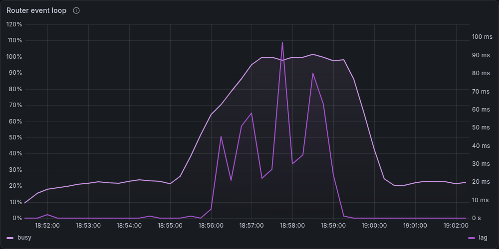

| Series | Shows                                                                                                                        |
| ------ | ---------------------------------------------------------------------------------------------------------------------------- |
| busy   | Share of wall time the event-loop thread spends on CPU, from `rate(narwhal_event_loop_busy_seconds_total)`, on the left axis |
| lag    | `narwhal_event_loop_lag_seconds`, the delay beyond the latest scheduled monitoring deadline, on the right axis               |

## Engine states

The **State** column shows the most serious state that applies to an engine. The states run from least to most serious:

| State       | Meaning                                                                                                            | Service        |
| ----------- | ------------------------------------------------------------------------------------------------------------------ | -------------- |
| Serving     | Normal operation                                                                                                   | In service     |
| Switching   | The engine finishes requests from its previous role after a flip                                                   | In service     |
| Backlogged  | vLLM reports waiting requests                                                                                      | In service     |
| Probation   | Placement ranks the engine lower after latency drift                                                               | In service     |
| Verifying   | A breaker health or inference probe is in flight                                                                   | In service     |
| Quarantined | A failure quarantine or inference-probe hold keeps the engine out of placement                                     | Out of service |
| Draining    | An operator drain holds the engine out of placement                                                                | Out of service |
| Ejected     | The breaker removed the engine from placement                                                                      | Out of service |
| Validating  | Readmission checks run against the engine                                                                          | Out of service |
| Blocked     | The engine waits for an operator, for example after a failed readmission check or during a whole-wave restart hold | Out of service |
| Unreachable | The engine's metrics endpoint fails to answer Prometheus                                                           | Out of service |
| Restarting  | The engine is unreachable while a drain holds it                                                                   | Out of service |

