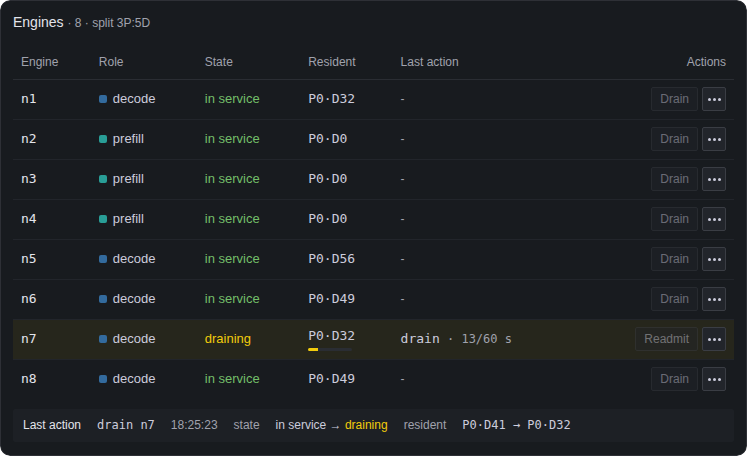
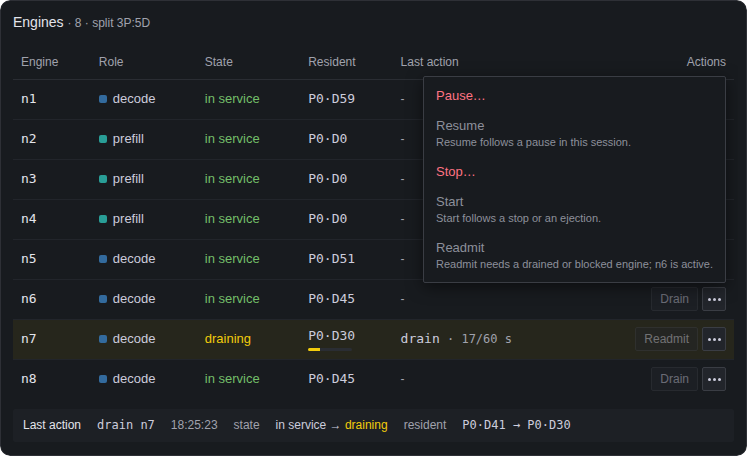

# Controlling the fleet

The fleet control service lets an operator test a running Narwhal fleet. From its console you can:

- pause, resume, stop, start, drain and readmit engines
- apply configuration overlays
- cold-restart the fleet and restore the baseline configuration
- run AIPerf load jobs

The service records every action in a private run record. You can use the console on its own page or inside the **Fleet control** Grafana dashboard, where it sits next to the fleet's charts.

The service runs on the router host and listens only on loopback. Every API request needs its bearer token. You reach the console and Grafana from your workstation through the operator tunnel.

The service doesn't know how your deployment starts or stops processes. You give it those commands as hooks in a private configuration file.

## Prerequisites

- A deployed fleet with the router serving on the router host, as in [Gate G](../deploy/07-Serve-and-Measure.md#starting-and-locally-verifying-the-router).
- The router shell: the router host's Narwhal checkout with `.venv` active, opened with `deploy_hosts.py shell`.
- The monitoring stack, started with `make observe` on the router host.
- The baseline fleet configuration file the router is running.
- A hook command for each action you plan to run. See [Hooks](#hooks).
- For load jobs, AIPerf on the router host. [Ordered benchmark points](../measure/05-Benchmark-Runner.md) names the AIPerf version to use.

## Setup

### 1. Write the private configuration

In the router shell, copy the example configuration and fill in its placeholders:

```bash
cp config/fleet-control.example.json config/fleet-control.local.json
```

The service reads `config/fleet-control.local.json` unless you pass `--config` or set `NARWHAL_CONTROL_CONFIG`. Git ignores every `config/fleet-control.*.json` file except the example, and `make publication` refuses to publish one.

At startup the service checks the whole file and reports all problems at once. Unknown keys are errors. Relative paths are resolved from the directory the service starts in.

| Key              | Default                  | Meaning                                                                                  |
| ---------------- | ------------------------ | ---------------------------------------------------------------------------------------- |
| `host`           | `127.0.0.1`              | Listener address. Must be a loopback address or `localhost`                              |
| `port`           | `8020`                   | Listener port                                                                            |
| `token_env`      | `NARWHAL_CONTROL_TOKEN`  | Environment variable that holds the bearer token                                         |
| `runs_dir`       | `runs/fleet-control`     | Where the action log and run records are written                                         |
| `fleet`          | `NARWHAL_FLEET` when set | Baseline fleet configuration file. Required if `NARWHAL_FLEET` is unset                  |
| `hooks`          | required                 | Hook commands by name. Must include `restore`                                            |
| `router`         | see [Router](#router)    | How to reach the router                                                                  |
| `prometheus_url` | none                     | Prometheus URL used to show firing alerts in the console, such as `http://127.0.0.1:9090` |
| `load`           | none                     | AIPerf settings and workloads. Without it, load jobs are unavailable                     |
| `console`        | none                     | Grafana settings for the console. Without it, the console shows no charts or dashboard links |

#### Hooks

Each hook is a command:

| Key         | Default | Meaning                                  |
| ----------- | ------- | ---------------------------------------- |
| `argv`      | required | Command and arguments, as a list of strings |
| `timeout_s` | `900`   | Seconds before the service stops the command |

| Hook             | Runs on                         | Must                                                                         |
| ---------------- | ------------------------------- | ---------------------------------------------------------------------------- |
| `restore`        | Ending a session, Restore baseline | Put the deployment back on the baseline configuration in `NARWHAL_CONTROL_BASELINE` |
| `engine_pause`   | Pause                           | Pause the engine in `NARWHAL_CONTROL_ENGINE`                                 |
| `engine_resume`  | Resume                          | Resume that engine                                                           |
| `engine_stop`    | Stop                            | Stop that engine                                                             |
| `engine_start`   | Start                           | Start that engine                                                            |
| `router_restart` | Apply overlay                   | Restart the router with the configuration in `NARWHAL_CONTROL_FLEET`         |
| `cold_restart`   | Cold restart                    | Restart every engine and the router with the configuration in `NARWHAL_CONTROL_FLEET` |

Only `restore` is required. An action whose hook isn't configured fails with HTTP 501, and the console disables it.

A hook succeeds if it exits with `0` before its timeout. The service runs each hook in its own process group with no standard input and logs its output to the session directory. On timeout, it sends SIGTERM to the group, then SIGKILL 5 seconds later.

Hooks inherit the service's environment, minus the token variable, plus these variables:

| Variable                     | Set for                          | Value                                                       |
| ---------------------------- | -------------------------------- | ----------------------------------------------------------- |
| `NARWHAL_CONTROL_SESSION`    | All hooks                        | Session ID                                                  |
| `NARWHAL_CONTROL_RUN_DIR`    | All hooks                        | Session directory                                           |
| `NARWHAL_CONTROL_BASELINE`   | All hooks                        | The session's copy of the baseline configuration            |
| `NARWHAL_CONTROL_ACTION`     | Engine hooks                     | `pause`, `resume`, `stop` or `start`                        |
| `NARWHAL_CONTROL_ENGINE`     | Engine hooks                     | Engine ID                                                   |
| `NARWHAL_CONTROL_ENGINE_URL` | Engine hooks                     | The engine's `url` from the baseline configuration, or empty |
| `NARWHAL_CONTROL_FLEET`      | `router_restart`, `cold_restart` | The configuration the restarted processes must load         |

All paths are absolute.

#### Router

| Key                        | Default                 | Meaning                                                                       |
| -------------------------- | ----------------------- | ----------------------------------------------------------------------------- |
| `router.url`               | `http://127.0.0.1:8000` | Router URL. Load jobs send their requests here too                            |
| `router.timeout_s`         | `600`                   | Timeout for lifecycle calls and for waiting on readiness after a restart      |
| `router.journal`           | none                    | Path of the router's request journal on this host                             |
| `router.journal_max_bytes` | `268435456` (256 MiB)   | Largest journal extract copied for one session or load job                    |

Set `router.journal` to the file the router writes: the `narwhal-serve --journal` path, or `journal.jsonl` next to `profiles.path` by default. The file doesn't need to exist when the service starts. Without `router.journal`, runs have no [journal extract](#journal-extracts).

#### Load

| Key                   | Default | Meaning                                                      |
| --------------------- | ------- | ------------------------------------------------------------ |
| `load.aiperf`         | required | AIPerf executable                                           |
| `load.model`          | required | Served model name                                           |
| `load.tokenizer`      | required | Tokenizer name or path                                      |
| `load.endpoint_type`  | `chat`  | `chat` or `completions`                                      |
| `load.streaming`      | `true`  | Whether AIPerf streams responses                             |
| `load.goodput`        | `{}`    | Goodput thresholds by AIPerf metric tag                      |
| `load.grace_period_s` | none    | Seconds AIPerf waits for in-flight responses after a timed job |
| `load.extra_args`     | `[]`    | Extra AIPerf arguments                                       |
| `load.workloads`      | required | Named workloads, at least one                               |

Workload names use letters, digits, `.`, `_` and `-`, up to 64 characters. Each workload has a `kind`:

| Kind                | Keys                                                                   | What AIPerf sends                                         |
| ------------------- | ---------------------------------------------------------------------- | --------------------------------------------------------- |
| `synthetic`         | `isl`, `osl` (tokens, required); `isl_stddev`, `osl_stddev` (default `0`) | Generated prompts with these input and output lengths     |
| `timestamped_trace` | `file` (a `mooncake_trace` JSONL file, required); `block_size` (optional) | The trace's requests at their recorded times              |
| `prefix_trace`      | `file` (required); `block_size` (required)                             | The trace's prompts with shared prefixes, at the job's rate or concurrency |

#### Console

| Key                        | Default          | Meaning                                                                    |
| -------------------------- | ---------------- | -------------------------------------------------------------------------- |
| `console.grafana_url`      | required         | Grafana's address as your workstation browser reaches it                   |
| `console.dashboard_uid`    | `narwhal-router` | Dashboard used for embedded panels and dashboard links. Use `narwhal-fleet-control` with the Fleet control dashboard |
| `console.panels`           | none             | Panel IDs to embed in the standalone console, in display order. Not needed with the Fleet control dashboard |
| `console.from`             | `now-15m`        | Time range start for embedded panels, such as `now-1h`                     |
| `console.refresh`          | `5s`             | Refresh interval for embedded panels                                       |
| `console.embed_in_grafana` | `false`          | Allow Grafana to show the console. See [Using the console from Grafana](#using-the-console-from-grafana) |
| `console.auto_connect`     | `false`          | Put the token in the page so it connects without asking. See [Connecting without the token field](#connecting-without-the-token-field) |

`console.grafana_url` is the workstation side of the tunnel, such as `http://127.0.0.1:13000`, not Grafana's address on the router host. The example configuration embeds the **Requests**, **Latency**, **Time to first token**, **Time per output token**, **Engine role history** and **Fleet events** panels, which [Reading the dashboard](../observability/05-Dashboard.md) describes.

Grafana must allow embedding. `make observe` sets `GF_SECURITY_ALLOW_EMBEDDING`. If an embedded panel stays empty, Grafana may predate that setting; run `make observe` again to recreate it.

### 2. Set the bearer token

The token must be at least 32 characters, with no leading or trailing whitespace. In the router shell, generate one:

```bash
export NARWHAL_CONTROL_TOKEN="$(openssl rand -hex 32)"
```

Keep it in the deployment's secret store. The service never passes it to hooks or AIPerf.

### 3. Start the service

In the router shell, from the checkout root, run:

```bash
.venv/bin/python -m tools.fleet_control.cli --config config/fleet-control.local.json
```

The service runs in the foreground. `--log-level` takes `critical`, `error`, `warning`, `info` (default) or `debug`. If the configuration is invalid, the token is missing or too short, or the port is taken, the service exits with status `2` and a `fleet control failed:` message.

To check it, run this from another router-host shell with the token exported:

```bash
curl -fsS -H "Authorization: Bearer $NARWHAL_CONTROL_TOKEN" http://127.0.0.1:8020/api/health
```

With no session open, it returns:

```json
{"status": "ok", "session": null, "job": null, "in_progress": null, "in_progress_since": null}
```

Press Ctrl+C to stop the service. It stops any running load job first.

## Reaching the console through the tunnel

The operator tunnel forwards workstation ports to the router host. [Tunnelling router, Prometheus, and Grafana to the workstation](../deploy/07-Serve-and-Measure.md#tunnelling-router-prometheus-and-grafana-to-the-workstation) covers its setup.

1. On the workstation, open a terminal in the checkout with `.env` loaded.
2. Open the tunnel with the control port and Grafana:

    ```bash
    python3 tools/deployment/deploy_hosts.py tunnel --role router \
      --forward 18020:8020 --forward 13000:3000
    ```

3. Leave the tunnel running.
4. Open `http://127.0.0.1:18020/console` in your browser.
5. Paste the bearer token into **Control token** and select **Connect**.

The Grafana port you forward must match `console.grafana_url`. If you use another port, update `console.grafana_url` and restart the service. If the service or Grafana listens on an address other than `127.0.0.1`, forward it with `--remote-address`, as in [Accessing dashboards and isolating listeners](../observability/02-Access.md#isolating-a-second-monitoring-stack).

### Console authentication

The console page itself needs no token and contains no fleet data. Every other request needs the token, or it gets HTTP 401.

After you connect, the page keeps the token in the tab's session storage and sends it as an `Authorization: Bearer` header. **Forget token** or closing the tab removes it. The token is never in a cookie, so other sites can't make your browser send authenticated requests. If the service answers 401, the page drops the token and asks again.

The console shows times in UTC. It follows your browser's light or dark setting unless the URL has `theme=light` or `theme=dark`.

### Connecting without the token field

With `console.auto_connect` set to `true`, the service puts the token in the console page and the page connects on load. There's no token field and no **Forget token** button.

Anyone who can reach the service's port can then read the token, so the tunnel and the loopback listener become the only protection. Every user and process on the router host, and every local process on a workstation with the tunnel open, can control the fleet. Don't enable it if either machine has users who shouldn't.

The service only serves this page when the request's `Host` is `127.0.0.1`, `localhost` or `::1`, and answers HTTP 421 otherwise. This stops another site from reading the token by pointing its domain at your loopback address. If the service restarts with a new token, reload the page.

## Using the console from Grafana

`make observe` creates a **Fleet control** dashboard (UID `narwhal-fleet-control`). It shows each part of the console in its own panel, next to charts from the Narwhal Orchestrator dashboard.

<div class="narwhal-panel-row" markdown>


</div>

To set it up:

1. In the router shell, set the `console` section of `config/fleet-control.local.json`:

    ```json
    "console": {
      "grafana_url": "http://127.0.0.1:13000",
      "dashboard_uid": "narwhal-fleet-control",
      "embed_in_grafana": true
    }
    ```

    To skip pasting the token, add `"auto_connect": true` after reading [Connecting without the token field](#connecting-without-the-token-field).

2. To show firing alerts in the console, set `prometheus_url` to `http://127.0.0.1:9090`.
3. Restart the control service.
4. If your browser reaches the console at an address other than `http://127.0.0.1:18020/console`, set `NARWHAL_CONTROL_CONSOLE_URL` to that address in the router shell.
5. To mark actions and load jobs on the charts, set up [dashboard annotations](#dashboard-annotations).
6. Run `make observe` on the router host.
7. Open the tunnel, as in [Reaching the console through the tunnel](#reaching-the-console-through-the-tunnel).
8. Open `http://127.0.0.1:13000/d/narwhal-fleet-control/fleet-control`.
9. Paste the token into any console panel and select **Connect**. The other panels connect too.

The session strip at the top shows **Connected**, and the **Engines** panel lists the fleet's engines.

### Dashboard layout

| Row                                  | Panels                                                                                       |
| ------------------------------------ | -------------------------------------------------------------------------------------------- |
| Top (no header)                      | Session strip; Requests; Latency against SLO; Engines; Engine role history; Request outcomes; Fleet events; Time to first token; Time per output token; Activity |
| **Load and configuration**           | Load job; Configuration                                                                       |
| **Controller** (collapsed)           | Pool assignments; Pool pressure                                                               |
| **Request & Recovery** (collapsed)   | Request waiting time; Retries and early exits; Admission in-flight; Queue depth; Dropped requests by reason; Failed attempts by reason; Expired KV by producer; Retry credits |

Session strip, Engines, Activity, Load job and Configuration are console panels. The rest are charts. Most are copies of Narwhal Orchestrator panels, described in [Reading the dashboard](../observability/05-Dashboard.md). Three are new:

- **Requests** shows the Requests table's columns as separate numbers.
- **Latency against SLO** shows TTFT p95 and TPOT p95 as a percentage of their SLO targets. The bars turn red at 100%.
- **Request outcomes** shows requests offered, completed and dropped per second. Dropped means refused, rejected, failed or expired.

An action in one console panel refreshes the others.

### Dashboard annotations

The dashboard marks fleet control activity on its charts:

- **Fleet control actions**: a dashed purple line when an action starts, labelled with the action and target, such as `drain n7`. Engine actions, overlays, cold restarts and restores are marked.
- **Load jobs**: a shaded band while a load job runs, labelled with the job ID.

<div class="narwhal-panel-row" markdown>


</div>

Prometheus gets this data by scraping the control service. To set that up:

1. In the router shell, export the control token in `NARWHAL_CONTROL_TOKEN`.
2. Export the control service's address as Prometheus reaches it. Prometheus uses host networking, so with the default port:

    ```bash
    export NARWHAL_CONTROL_METRICS_URL=http://127.0.0.1:8020
    ```

3. Run `make observe`. It adds the scrape target and gives Prometheus the token.
4. Check the scrape:

    ```bash
    curl -fsSG http://127.0.0.1:9090/api/v1/query \
      --data-urlencode 'query=up{job="fleet-control"}' \
      | python3 -m json.tool
    ```

    A value of `1` means Prometheus is scraping the service.

`make observe` always reads the token from `NARWHAL_CONTROL_TOKEN`, even if the service uses another `token_env`. If `NARWHAL_CONTROL_METRICS_URL` is set and the token isn't, `make observe` stops with an error. If the service restarts with a new token, run `make observe` again.

### Framing boundary

`console.embed_in_grafana` lets pages from the `console.grafana_url` origin show the console. Browsers block every other site from showing it. The API still needs the token.

The console runs in a sandboxed frame on its own origin, so Grafana pages can't read its token. The sandbox allows downloads, for **Run record** and **Job document**, and lets **From session start** open the dashboard in the Grafana tab.

Grafana normally sanitizes Text panel HTML, which would stop the console's script. `make observe` turns that off with `GF_PANELS_DISABLE_SANITIZE_HTML`. As a result, anyone who can edit dashboards can add script that runs in other users' Grafana pages. Anonymous users only get Viewer access; give edit rights to operators only.

## Sessions

A session is one test run. You must start a session before any other action.

**Start session** copies the baseline fleet configuration into a new session directory and records it as the session's first configuration.

**End session and restore** stops any running load job, runs the `restore` hook, saves the session's [journal extract](#journal-extracts) and closes the session. It doesn't wait for the router to become ready. If the restore fails, the session stays open so you can try again. The console asks you to confirm first.

### Session strip

The session strip runs along the top of the console:

<div class="narwhal-panel-row" markdown>


</div>

| Item             | Shows                                                                                       |
| ---------------- | ------------------------------------------------------------------------------------------- |
| Connection       | **Connected**, **Service unreachable** or **Not connected**                                 |
| **Admission**    | **Ready** if the router accepts requests, otherwise **Not ready** or **Unreachable**. Hover for the router's reason |
| **Alerts**       | Number of firing Narwhal alerts, red if any is a page. Needs `prometheus_url`. Hover for the alert names |
| **In progress**  | Actions that haven't finished yet, such as `drain n7`                                       |
| **Session**      | Short session ID. Hover for the start time                                                  |
| **From session start** | Opens the dashboard with its time range starting at the session start                  |
| **Load job**     | Current or last job, its state and elapsed time                                              |
| **Drain deadline (s)** | Deadline for drains started from this tab. Leave it empty to use the router's default  |
| Buttons          | **Start session** or **End session and restore**, and **Forget token**                     |

### Exclusive actions

Starting or ending a session, applying an overlay, a cold restart and restoring the baseline are exclusive: while one runs, every other action is refused with HTTP 409. Engine actions and load jobs can run at the same time as each other. Status reads always work.

## Engine actions

The **Engines** view lists the fleet's engines with their role, state, resident requests and last action. Its heading shows the prefill-to-decode split of the engines in service, such as `split 2P:6D`.

<div class="narwhal-panel-row" markdown>



</div>

Each row has one main button for the engine's state and a **…** menu with the other actions:

| Engine state                    | Main button |
| ------------------------------- | ----------- |
| Paused in this session          | **Resume**  |
| Stopped in this session         | **Start**   |
| Draining, drained or blocked    | **Readmit** |
| Ejected by the router           | **Readmit** (disabled; the router readmits it on its own) |
| In service                      | **Drain**   |

| Action      | What it does                                                                                      |
| ----------- | ------------------------------------------------------------------------------------------------- |
| **Pause**   | Runs `engine_pause`                                                                               |
| **Resume**  | Runs `engine_resume`                                                                              |
| **Stop**    | Runs `engine_stop`                                                                                |
| **Start**   | Runs `engine_start`                                                                               |
| **Drain**   | Asks the router to [drain](../http-api/07-Handoff-and-Lifecycle.md#post-narwhallifecycledrain) the engine: it stops sending new requests and waits for current ones to finish |
| **Readmit** | Asks the router to [readmit](../http-api/07-Handoff-and-Lifecycle.md#post-narwhallifecyclereadmit) a drained engine |

Pause, Stop and Drain ask for confirmation. A drain uses **Drain deadline (s)**, or the router's default of 300 seconds. While it runs, a bar under the engine's resident requests shows how much has drained.

Unavailable actions are disabled, and the reason shows in the tooltip or under the menu item:

<div class="narwhal-panel-row" markdown>



</div>

- Pause, Resume, Stop and Start need their hook configured. Resume needs a paused engine; Start needs a stopped or ejected one.
- Drain needs an engine in service, and no other engine draining or being readmitted. The router handles one at a time.
- Readmit needs a drained or blocked engine. If the router expects the engine to restart after the drain, Readmit stays disabled until it has. See [Readmit stays disabled after a drain](#readmit-stays-disabled-after-a-drain).
- No engine action is available outside a session or during an exclusive action.

The router can't see pause, stop and the other hook actions, so the console tracks them from the session's record. Restoring the baseline or a cold restart clears them.

The **Last action** line under the table shows the latest engine action and how the engine's state and resident requests changed. The run record keeps the router's full view of the engine before and after each action.

## Load jobs

The service runs one AIPerf job at a time against the router. To change the rate or duration, start a new job.

<div class="narwhal-panel-row" markdown>


</div>

In the **Load job** view, pick a workload and set:

- **Rate (req/s)**: requests per second
- **Concurrency**: maximum requests in flight
- **Duration (s)**: how long to run

Synthetic and prefix-trace workloads need a duration and a rate, a concurrency or both. Timestamped traces replay at their recorded times, so they don't take a rate; concurrency and duration can cap and shorten the replay. The hint under the inputs shows what the selected workload accepts.

While the job runs, the inputs are locked and the strip shows its progress. **Stop job** ends it early. When it finishes, the view shows:

- completed requests, total requests and errors
- request and output-token throughput, and goodput if `load.goodput` is set
- TTFT, inter-token latency and request latency at p50, p95 and p99
- AIPerf's exit code and the number of journal lines captured

**Job document** downloads the full result as `<job>.json`. A job fails if its trace can't be read, AIPerf fails to start or exits non-zero, or AIPerf writes no summary.

## Configuration overlays, cold restarts and restores

The **Configuration** view shows the session's baseline file and, under **Changed from baseline**, every setting that now differs from it.

An overlay is a partial fleet configuration merged onto the current one as a JSON merge patch (RFC 7386):

- Objects merge key by key.
- `null` removes a key, which returns it to its default.
- Anything else, including arrays, replaces the current value.

An overlay can only change `slo`, `controller`, `serving` and `recovery`, plus keys starting with `_`. [Serving and role control](../configuration/02-Serving-and-Role-Control.md) and [Recovery and validation](../configuration/03-Recovery-and-Validation.md) list their fields. For example, this overlay sets the admission margin to 10% of the TTFT target:

```json
{"serving": {"admission_margin": 0.1}}
```

To apply an overlay:

1. Enter it in the **Configuration** view.
2. Select **Check overlay**. The view lists each setting it changes, with the current and new value, or the errors. Nothing is applied yet.
3. Select **Apply overlay** and confirm. The service validates the merged configuration with the same loader as `narwhal config validate`, saves it in the session directory and runs `router_restart` with it.

**Cold restart** runs `cold_restart` with the current configuration.

**Restore baseline** runs `restore` and makes the baseline the current configuration again.

After each of these, the service waits until the router reports ready, up to `router.timeout_s`. If the router doesn't become ready, the action fails with HTTP 504, but an overlay that `router_restart` applied stays in effect.

## Activity

The **Activity** view lists the session's actions, newest first, with their start time, target, duration and outcome. A running drain shows as `in progress`.

<div class="narwhal-panel-row" markdown>


</div>

**Run record** downloads the session's [run record](#run-record) as `run-<session>.json`.

## Troubleshooting

### A console panel shows a browser error page

The browser blocked the console from being shown in Grafana. Check the console's headers from the router shell:

```bash
curl -sS -D - -o /dev/null http://127.0.0.1:8020/console | grep -iE 'x-frame-options|content-security-policy'
```

- `X-Frame-Options: DENY` or `frame-ancestors 'none'`: set `console.embed_in_grafana` to `true` and restart the service.
- `frame-ancestors` with another address: set `console.grafana_url` to the address in your browser's address bar and restart the service.

Reload the dashboard. Each console panel should show **Control token** or connect.

### Actions and load jobs aren't marked on the charts

Check whether Prometheus is scraping the control service:

```bash
curl -fsSG http://127.0.0.1:9090/api/v1/query \
  --data-urlencode 'query=up{job="fleet-control"}' \
  | python3 -m json.tool
```

- No result: `NARWHAL_CONTROL_METRICS_URL` wasn't set when `make observe` last ran. Set it and `NARWHAL_CONTROL_TOKEN`, as in [Dashboard annotations](#dashboard-annotations), and run `make observe` again.
- Value `0`: open Prometheus's `/targets` page and read the `fleet-control` error. HTTP 401 means Prometheus has an old token; export the current one and run `make observe` again. A refused connection means `NARWHAL_CONTROL_METRICS_URL` has the wrong address.

Run an engine action to check. Its marker appears on **Request outcomes** once it finishes.

### Readmit stays disabled after a drain

**Readmit** shows `<engine> must restart before readmission: stop and start it, or restart the engine wave.`

The router only readmits this engine after it restarts.

1. Restart the engine: select **Stop**, then **Start**. Without those hooks, restart it through its process manager, as in [Replacing the process](03-Restart-Engines.md#72-replacing-the-process). With the `whole_wave` restart policy, restart the engine wave, as in [Restarting an engine wave](03-Restart-Engines.md#8-restarting-an-engine-wave).
2. Wait for **Readmit** to become available.
3. Select **Readmit**. The engine returns to `in service`.

### An engine won't start after a stop

**Start** fails, and the engine's startup log reports less free GPU memory than it needs. This happens on hosts shared with other KV-transfer engines: another engine still holds the stopped engine's KV memory, as described in [Peer memory release](../concepts/03-Failure-and-State.md#peer-memory-release).

Restart the engine wave, as in [Restarting an engine wave](03-Restart-Engines.md#8-restarting-an-engine-wave). The start hook's output is in `hooks/<nnn>-engine_start.log` in the session directory.

## API reference

Every route except `GET /console` needs the bearer token. Without it, the service returns HTTP 401 with `WWW-Authenticate: Bearer` and `{"detail": "missing or invalid bearer token"}`.

A successful action returns its run-record entry. A refused or failed action returns `{"detail": "<reason>", "action": <entry>}`. A malformed body returns HTTP 422 with `detail` only and isn't recorded. An unexpected error returns HTTP 500 and is recorded as failed.

### Sessions and status

| Route                   | Status | Meaning                                                              |
| ----------------------- | ------ | -------------------------------------------------------------------- |
| `POST /api/session`     | 201    | Session started. The result has the session ID and baseline digest   |
|                         | 409    | A session is already open, or an exclusive action is running         |
|                         | 500    | The baseline configuration can't be read or is invalid               |
| `POST /api/session/end` | 200    | Restore succeeded and the session closed                             |
|                         | 409    | No session, or an exclusive action is running                        |
|                         | 502    | The restore hook failed; the session stays open                      |
| `GET /api/session`      | 200    | The session's run record                                             |
|                         | 404    | No session                                                           |
| `GET /api/health`       | 200    | `status`, `session`, the current or last `job`, and the exclusive action in progress with its start time |
| `GET /api/console`      | 200    | Grafana links (`grafana`, or `null`), whether load jobs are configured (`load`), and configured hook names (`hooks`) |

### Engines

| Route                              | Action                                         |
| ---------------------------------- | ---------------------------------------------- |
| `POST /api/engines/{iid}/pause`    | Runs `engine_pause`                            |
| `POST /api/engines/{iid}/resume`   | Runs `engine_resume`                           |
| `POST /api/engines/{iid}/stop`     | Runs `engine_stop`                             |
| `POST /api/engines/{iid}/start`    | Runs `engine_start`                            |
| `POST /api/engines/{iid}/drain`    | Drains the engine. Optional body: `{"deadline_s": <seconds>}` |
| `POST /api/engines/{iid}/readmit`  | Readmits the engine                            |
| `GET /api/engines`                 | The router's state for every engine            |

| Status | Meaning                                                          |
| ------ | ---------------------------------------------------------------- |
| 200    | The hook exited `0`, or the router accepted the call             |
| 404    | Unknown engine ID                                                |
| 409    | No session, or an exclusive action is running                    |
| 422    | Invalid body                                                     |
| 501    | The hook isn't configured                                        |
| 502    | The hook failed or timed out, or the router refused or was unreachable |

Before and after each engine action, the service saves the engine's router state: `known`, `role`, `ejected`, `draining`, `quarantined`, `probation`, `pinned`, `resident`, `breaker`, `lifecycle`, `process_start`, and the router's `router` and `wave` lifecycle state. If the state can't be read, it saves the error in `error` and runs the action anyway.

`GET /api/engines` uses the session's baseline during a session and the `fleet` file otherwise. It returns HTTP 500 if that file can't be read and HTTP 502 if the router can't be reached.

### Load jobs

`POST /api/jobs` takes `workload` (required), `rate`, `concurrency` and `duration_s`.

| Route                         | Status | Meaning                                                    |
| ----------------------------- | ------ | ---------------------------------------------------------- |
| `POST /api/jobs`              | 201    | Job started                                                |
|                               | 409    | No session, a job is running, or an exclusive action is running |
|                               | 422    | Invalid parameters; the message lists each problem         |
|                               | 501    | No `load` section                                          |
| `POST /api/jobs/current/stop` | 200    | Job stopped                                                |
|                               | 409    | No job running, no session, or an exclusive action is running |
| `GET /api/jobs/current`       | 200    | The running job, or the last one this session              |
|                               | 404    | No job                                                     |
| `GET /api/workloads`          | 200    | The workloads, without trace file paths. Only with a `load` section |

A job document has `id`, `params`, `state` (`running`, `succeeded`, `failed` or `stopped`), `started_at`, `finished_at`, `error`, `result` and `journal`. `result` holds the AIPerf command, exit code, duration and workload (with the trace's SHA-256 for trace workloads), request counts, throughput, latency statistics and goodput. `journal` is the job's [journal extract](#journal-extracts), `null` while it runs.

### Configuration

| Route                            | Action                                                         |
| -------------------------------- | -------------------------------------------------------------- |
| `POST /api/config/overlay`       | Applies an overlay                                             |
| `POST /api/config/overlay/check` | Checks an overlay without applying or recording it             |
| `POST /api/config/cold-restart`  | Runs `cold_restart`                                            |
| `POST /api/config/restore`       | Runs `restore`                                                 |

| Status | Meaning                                                                 |
| ------ | ----------------------------------------------------------------------- |
| 200    | The hook succeeded and the router is ready                              |
| 409    | No session, or an exclusive action is running                           |
| 422    | Overlay only: not an object, changes nothing, changes another section, or invalid |
| 501    | The hook isn't configured                                               |
| 502    | The hook failed or timed out                                            |
| 504    | The router wasn't ready within `router.timeout_s`                       |

The check returns HTTP 200 with `errors`, `base_digest` (the current configuration), `digest` (the merged result, or `null` if it has errors) and `document` (the merged configuration).

### Fleet signals and metrics

`GET /api/fleet` returns the router's readiness and, with `prometheus_url`, the firing Narwhal alerts. It returns HTTP 200 even if the router or Prometheus doesn't answer, and reports the problem in the body.

| Field                | Meaning                                                    |
| -------------------- | ---------------------------------------------------------- |
| `router.ready`       | `true` if the router's `GET /ready` returned HTTP 200      |
| `router.status_code` | The status code, or `null` if the router didn't answer within 5 seconds |
| `router.reason`      | The router's reason, or the error                          |
| `router.path`        | `/ready`                                                   |
| `alerts`             | `null` without `prometheus_url`                            |
| `alerts.firing`      | Firing alerts with their `alertname` and `labels`, or `null` if the query failed |
| `alerts.error`       | Why the query failed, or `null`                            |

The alerts are those matching `ALERTS{alertname=~"Narwhal.+",alertstate="firing",severity!="info"}`, the same ones the Narwhal Orchestrator **Router** panel counts.

`GET /metrics` returns Prometheus metrics for the dashboard annotations:

| Metric                              | Labels                                                   | Value                                         |
| ----------------------------------- | -------------------------------------------------------- | --------------------------------------------- |
| `narwhal_control_session_active`    | none                                                     | `1` during a session, otherwise `0`           |
| `narwhal_control_action_started_ms` | `session`, `seq`, `action`, `target`, `outcome`, `title` | Start time of a finished action, in Unix milliseconds |
| `narwhal_control_load_job_running`  | `job`, `workload`                                        | `1` while the job runs                        |

`narwhal_control_action_started_ms` covers the open session's engine actions, overlays, cold restarts and restores, except refused ones. `title` is the label shown on the chart, such as `drain n7`.

## Run record

The service writes records under `runs_dir` (default `runs/fleet-control/`), which Git ignores. Directories are created with mode `0700` and files with `0600`.

```text
runs/fleet-control/
  actions.jsonl                  every authenticated action, one per line
  sessions/
    <session>/                   <UTC start, YYYYMMDDTHHMMSSZ>-<six hex characters>
      run.json                   the run record, rewritten after each action
      baseline.json              copy of the baseline configuration
      hooks/<nnn>-<hook>.log     output of each hook run
      overlays/<nnn>-fleet.json  each applied overlay, merged
      journal/
        job-<nnn>.jsonl          router journal lines from each load job
        session.jsonl            router journal lines from the whole session
      jobs/job-<nnn>/
        aiperf.log               AIPerf output
        aiperf/                  AIPerf artifacts
```

`actions.jsonl` also has actions refused outside a session, with `seq` and `session` set to `null`.

`run.json`:

| Field            | Meaning                                                   |
| ---------------- | --------------------------------------------------------- |
| `schema`         | `narwhal.fleet-control-run`                               |
| `schema_version` | `1`                                                       |
| `session`        | Session ID                                                |
| `started_at`     | Session start, ISO 8601 UTC                               |
| `ended_at`       | When the session closed, or `null`                        |
| `baseline`       | `source` (the file read) and `copy` (`baseline.json`)     |
| `configuration`  | The current configuration                                 |
| `configurations` | Every applied configuration, in order                     |
| `actions`        | Every action, in order                                    |

Each configuration has `applied_at`, `source` (`baseline` or `overlay`), `fleet` (its file in the session directory), `digest` (canonical SHA-256) and `document`.

Each action has:

| Field         | Meaning                                         |
| ------------- | ----------------------------------------------- |
| `seq`         | Position in the session from `1`, or `null`     |
| `session`     | Session ID, or `null`                           |
| `action`      | Action name                                     |
| `params`      | Request parameters                              |
| `started_at`  | Start, ISO 8601 UTC                             |
| `finished_at` | Finish, ISO 8601 UTC                            |
| `outcome`     | `ok`, `refused` or `failed`                     |
| `result`      | What the action did, or `null`                  |
| `error`       | Why it was refused or failed, or `null`         |

| Action                                                         | `result`                                                         |
| -------------------------------------------------------------- | ---------------------------------------------------------------- |
| `session.start`                                                | `session`, `baseline_digest`                                     |
| `session.end`                                                  | `restore_seq` (the restore's `seq`) and `journal`               |
| `baseline.restore`                                             | The hook run                                                     |
| `engine.pause`, `engine.resume`, `engine.stop`, `engine.start` | `engine`, `before`, `hook`, `after`                              |
| `engine.drain`, `engine.readmit`                               | `engine`, `before`, `router` (the call's `path`, `body`, `status`, `error`), `after` |
| `job.start`, `job.stop`                                        | `job`, the job document                                          |
| `job.complete`                                                 | The job document                                                 |
| `config.overlay`                                               | `fleet`, `digest`, `base_digest`, `hook`, `readiness`            |
| `config.cold_restart`                                          | `fleet`, `digest`, `hook`, `readiness`                           |
| `config.restore`                                               | `restore_seq`, `fleet`, `digest`, `readiness`                    |

A hook run has `hook`, `argv`, `exit_code`, `timed_out`, `duration_s`, `log` and `tail` (the last 4096 bytes of output). `readiness` has `path`, `ready`, `attempts`, `waited_s`, `status_code` and `reason`.

### Journal extracts

Each load job and each session saves the router journal lines written while it ran. Journal times are relative to the router process, so the service uses file positions instead. It notes the journal's size when the run starts and copies everything added after that when the run ends.

- Lines written after the copy starts aren't included.
- An incomplete last line isn't included.
- The copy stops before it would exceed `router.journal_max_bytes`.
- If the journal was replaced or truncated during the run, or didn't exist at the start, the copy starts from the beginning of the current file.

If the router restarted during a session, the extract has lines from more than one router process. Each line's `run` field says which.

The copy happens while the service handles the request, so a large extract delays other requests.

The `journal` entry in a job document or `session.end` result has:

| Field          | Meaning                                                  |
| -------------- | -------------------------------------------------------- |
| `extract`      | The extract file, or `null` if nothing was copied        |
| `start_offset` | Journal byte offset where the copy started               |
| `end_offset`   | Journal byte offset after the last copied line           |
| `lines`        | Lines copied                                             |
| `bytes`        | Bytes copied                                             |
| `terminal`     | Count of finished requests by outcome, such as `completed` or `refused` |
| `notes`        | Anything that affected the copy, such as a missing or replaced journal, a dropped partial line, or the size limit |

[Request journal](../telemetry/01-Journal.md) describes the journal lines.
