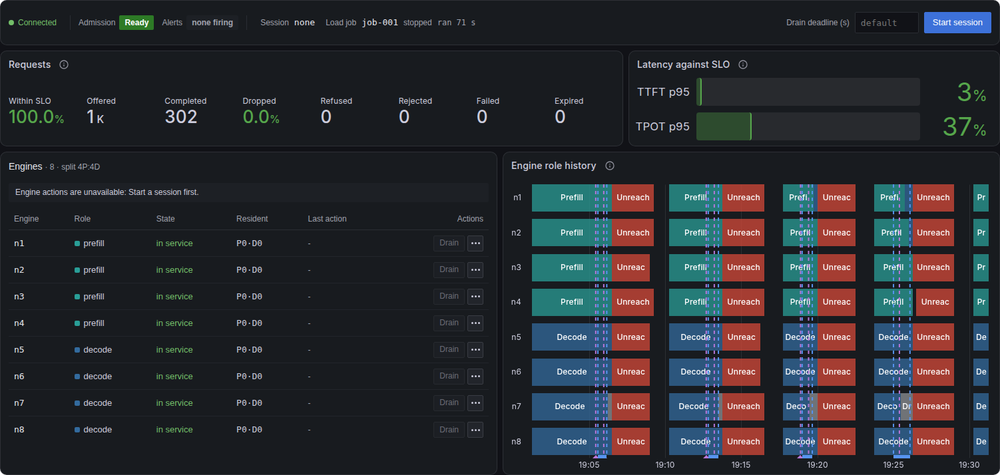

# Using the console from Grafana

`make observe` provisions a **Fleet control** dashboard with UID `narwhal-fleet-control`. It shows each console view in its own panel. The charts stay on the **Narwhal Orchestrator** dashboard, which marks each action and load job.

<div class="narwhal-panel-row" markdown>



</div>

## Open the console in Grafana

The service must be set up as in [Setting up the control service](01-Set-Up-the-Service.md).

1. In the router shell, set the `console` section of `config/fleet-control.local.json`:

    ```json
    "console": {
      "grafana_url": "http://127.0.0.1:13000",
      "embed_in_grafana": true
    }
    ```

    To connect when the page loads, also set `"auto_connect": true`. Read [Connecting automatically](02-Open-the-Console.md#connecting-automatically) first.

2. To show firing alerts in the session strip, set `prometheus_url` to `http://127.0.0.1:9090`.
3. Restart the control service.
4. If the browser reaches the console at an address other than `http://127.0.0.1:18020/console`, set `NARWHAL_CONTROL_CONSOLE_URL` to that address in the router shell. For a console served under Grafana's own address, use its path, such as `/fleet-control/console`.
5. To mark actions and load jobs on the charts, set up [dashboard annotations](#dashboard-annotations).
6. Run `make observe` on the router host.
7. Open the tunnel, as in [Reaching the console through the tunnel](02-Open-the-Console.md#reaching-the-console-through-the-tunnel).
8. Open `http://127.0.0.1:13000/d/narwhal-fleet-control/fleet-control`.
9. Paste the token into any console panel and select **Connect**. The other console panels connect with it.

The session strip shows **Connected**, and the **Engines** panel lists the fleet's engines.

## Dashboard layout

| Row | Panels                    |
| --- | ------------------------- |
| 1   | Session strip             |
| 2   | Engines                   |
| 3   | Load job, Load metrics    |
| 4   | Configuration, Activity   |

An action in one panel refreshes the others.

## Dashboard annotations

The **Narwhal Orchestrator** dashboard marks fleet control activity on its charts with two annotation layers:

- **Fleet control actions** draws a dashed purple line at the start of each engine action, overlay, cold restart and restore, labelled with the action and target, such as `drain n7`.
- **Load jobs** shades each load job's interval and labels it with the job ID.

<div class="narwhal-panel-row" markdown>


</div>

Prometheus reads these events from the control service's `GET /metrics`. To add the scrape:

1. In the router shell, export the control token in `NARWHAL_CONTROL_TOKEN`.
2. Export the control service's address as Prometheus reaches it. Prometheus uses host networking, so with the default port:

    ```bash
    export NARWHAL_CONTROL_METRICS_URL=http://127.0.0.1:8020
    ```

3. Run `make observe`. It writes the `fleet-control` scrape target and passes the token to Prometheus.
4. Query the scrape status:

    ```bash
    curl -fsSG http://127.0.0.1:9090/api/v1/query \
      --data-urlencode 'query=up{job="fleet-control"}' \
      | python3 -m json.tool
    ```

    A value of `1` marks a successful scrape.

`make observe` reads the token from `NARWHAL_CONTROL_TOKEN`, even when the service's `token_env` names another variable. After the service restarts with a new token, run `make observe` again.

## Framing boundary

With `console.embed_in_grafana` set, the console accepts frames from the `console.grafana_url` origin and from its own origin.

A console served under Grafana's own address, such as `/fleet-control/console`, shares Grafana's origin, so script in Grafana pages can read its token. Serve the console on its own port to keep the token separate from Grafana.

Grafana removes the console frames from Text panels unless HTML sanitizing is off. `make observe` turns it off with `GF_PANELS_DISABLE_SANITIZE_HTML`.

!!! warning
    With sanitizing off, any user who can edit a dashboard can add script that runs in other users' Grafana pages. Grafana gives anonymous users Viewer access. Grant dashboard edit rights to operators only.
