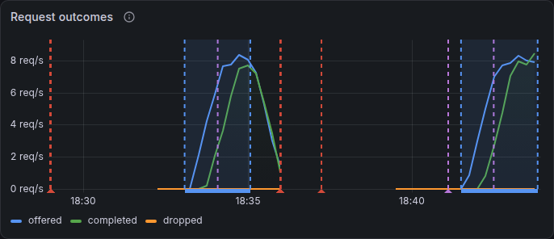

# Using the console from Grafana

The **Narwhal Orchestrator** dashboard has a **Fleet control** link in its dashboard links, which opens the console in a new tab. The dashboard also marks each action and load job on its charts.

## Open the console from Grafana

The service must be set up as in [Setting up the control service](01-Set-Up-the-Service.md).

1. If the browser reaches the console at an address other than `http://127.0.0.1:18020/console`, set `NARWHAL_CONTROL_CONSOLE_URL` to that address in the router shell. For a console served under Grafana's own address, use its path, such as `/fleet-control/console`.
2. To mark actions and load jobs on the charts, set up [dashboard annotations](#dashboard-annotations).
3. Run `make observe` on the router host.
4. Open the tunnel, as in [Reaching the console through the tunnel](02-Open-the-Console.md#reaching-the-console-through-the-tunnel).
5. Open `http://127.0.0.1:13000/d/narwhal-router/narwhal-orchestrator` and select **Fleet control**.

The console opens in a new tab. After you connect, the session strip shows **Connected**.

## Dashboard annotations

The **Narwhal Orchestrator** dashboard marks fleet control activity on its charts with two annotation layers:

- **Fleet control actions** draws a dashed purple line at the start of each engine action, overlay, cold restart and restore, labelled with the action and target, such as `drain n7`.
- **Load jobs** shades each load job's interval and labels it with the job ID.

<div class="narwhal-panel-row" markdown>



</div>

Prometheus reads these events from the control service's `GET /metrics`. To add the scrape:

1. In the router shell, export the control token in `NARWHAL_CONTROL_TOKEN`.
2. Export the control service's address as Prometheus reaches it. Prometheus uses host networking, so with the default port:

    ```bash
    export NARWHAL_CONTROL_METRICS_URL=http://127.0.0.1:8020
    ```

3. Run `make observe`. It writes the `fleet-control` scrape target and passes the token to Prometheus.
4. Query the scrape status:

    ```bash
    curl -fsSG http://127.0.0.1:9090/api/v1/query \
      --data-urlencode 'query=up{job="fleet-control"}' \
      | python3 -m json.tool
    ```

    A value of `1` marks a successful scrape.

`make observe` reads the token from `NARWHAL_CONTROL_TOKEN`, even when the service's `token_env` names another variable. After the service restarts with a new token, run `make observe` again.

## Framing boundary

With `console.embed_in_grafana` set, the console accepts frames from the `console.grafana_url` origin and from its own origin.

A console served under Grafana's own address, such as `/fleet-control/console`, shares Grafana's origin, so script in Grafana pages can read its token. Serve the console on its own port to keep the token separate from Grafana.
