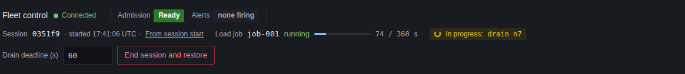
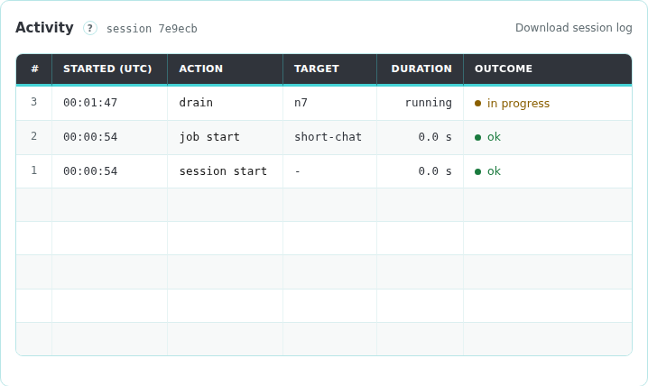

# Running a test session

A session is one operator test run. Every action except **Start session** requires an active session; the service returns HTTP 409 otherwise.

## Start and end a session

**Start session** loads the baseline fleet configuration through the fleet configuration loader, copies it into a new session directory, and records it as the session's first configuration.

**End session and restore** asks for confirmation, then:

1. stops a running load job and records `job.stop`
2. runs the `restore` hook and records `baseline.restore`
3. copies the session's [journal extract](11-Run-Record.md#journal-extracts)
4. records `session.end` and closes the session

Unlike **Restore baseline**, ending a session skips the router readiness wait. If the restore hook fails, the session stays open so you can retry.

## Session strip

The session strip runs along the top of the console.

| Item                   | Shows                                                                                                                         |
| ---------------------- | ----------------------------------------------------------------------------------------------------------------------------- |
| Connection             | **Connected**, **Service unreachable** or **Not connected**                                                                   |
| **Admission**          | **Ready** when the router admits requests, otherwise **Not ready** or **Unreachable**. The tooltip holds the router's reason  |
| **Alerts**             | Number of firing Narwhal alerts, red when any has page severity. Requires `prometheus_url`. The tooltip lists the alert names |
| **In progress**        | Actions still running, such as `drain n7`                                                                                     |
| **Session**            | Short session ID. The tooltip holds the start time                                                                            |
| **From session start** | Opens the dashboard with its time range starting at the session start                                                         |
| **Load job**           | The current or last job, its state and its elapsed time                                                                       |
| **Drain deadline (s)** | Deadline for drains started from this tab. Empty uses the router's default                                                    |
| Buttons                | **Start session** or **End session and restore**, and **Forget token**                                                        |

The console polls the service's status every 2 seconds, the engine table every 3 seconds, and router readiness and alerts every 5 seconds.

## Exclusive actions

Session start and end, configuration overlays, cold restarts and baseline restores are exclusive. While one runs, the service returns HTTP 409 with the message `<action> is in progress` to every other action. Status reads such as `GET /api/health` continue to work.

Engine actions and load jobs run concurrently, so you can drain an engine during a load job.

## Activity

The **Activity** view lists the session's actions, newest first, with each action's start time, target, duration and outcome. A drain stays `in progress` until the router finishes it.

**Run record** downloads the session's [run record](11-Run-Record.md) as `run-<session>.json`.
