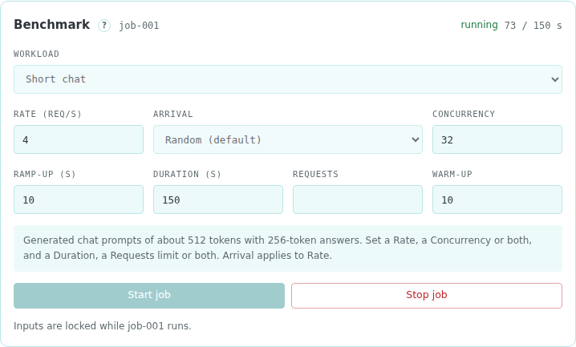

# Load jobs

The service runs one AIPerf job at a time against `router.url`. To change the rate or duration, start a new job. Load jobs require the [`load`](09-Configuration-Reference.md#load) configuration section.

## Choose a workload

The hint under the inputs describes the selected workload and the inputs it accepts. [Workloads](09-Configuration-Reference.md#workloads) defines the workload kinds and their keys.

## Start a job

In the **Load job** view, select a workload and set its inputs:

| Input            | Field             | Meaning                                                                                                  | Range        | Default  |
| ---------------- | ----------------- | -------------------------------------------------------------------------------------------------------- | ------------ | -------- |
| Rate (req/s)     | `rate`            | Requests per second                                                                                      | 0.1 to 1000  | 2        |
| Arrival          | `arrival`         | Spacing of requests at the rate: `random` (Poisson), `steady` (even) or `bursty` (gamma, smoothness 0.5) |              | `random` |
| Concurrency      | `concurrency`     | Maximum requests in flight                                                                               | 1 to 4096    | 32       |
| Ramp-up (s)      | `ramp_s`          | Seconds to rise from a low start to the rate and the concurrency                                         | 1 to 3600    | 10       |
| Duration (s)     | `duration_s`      | Seconds of load                                                                                          | 1 to 86400   | 300      |
| Requests         | `requests`        | Number of requests to send                                                                               | 1 to 1000000 | 1000     |
| Warm-up          | `warmup_requests` | Requests sent before measurement. The results leave them out                                             | 1 to 10000   | 10       |

Concurrency, Requests and Warm-up take whole numbers. The console and the service refuse values outside the range.

Selecting a workload fills each empty input with its default. A `timestamped_trace` workload clears every input, so the trace replays in full at its recorded times.

Each workload kind accepts these inputs:

| Input             | `synthetic`, `mixed`, `multi_turn`, `public_dataset`, `prefix_trace` | `timestamped_trace`                                |
| ----------------- | -------------------------------------------------------------------- | -------------------------------------------------- |
| `rate`            | Set `rate`, `concurrency` or both                                    | Rejected                                           |
| `arrival`         | Optional. Requires `rate`                                            | Rejected                                           |
| `concurrency`     | Set `rate`, `concurrency` or both                                    | Optional. Caps the requests in flight              |
| `ramp_s`          | Optional. Ramps the rate and the concurrency that are set            | Rejected                                           |
| `duration_s`      | Set `duration_s`, `requests` or both                                 | Optional. Shortens the replay                      |
| `requests`        | Set `duration_s`, `requests` or both                                 | Optional. Ends the replay after this many requests |
| `warmup_requests` | Optional                                                             | Rejected                                           |

A `timestamped_trace` workload sends each request at its recorded time. With both `duration_s` and `requests` set, the job stops at the first limit it reaches. In a `multi_turn` workload, `rate` counts turns and `concurrency` counts conversations.

## While the job runs

The view locks its inputs, and the session strip shows the job's progress. **Stop job** stops AIPerf.

## Load metrics

**Load metrics** updates every few seconds while the job runs and keeps the final figures when it ends. It reads AIPerf's per-request records and leaves out warm-up requests. It shows:

- the job's progress against its duration
- completed requests, errors, requests per second and output tokens per second
- the share of requests within the SLO, when `load.goodput` is configured
- time to first token, inter-token latency and request latency at p50, p95 and p99, with the `load.goodput` target beside each
- charts of completed requests per second and time to first token p95 over the job

A p95 value turns yellow at 80% of its target and red at 100%.

**Job document** downloads the full job document as `<job>.json`. [Load jobs](10-API-Reference.md#load-jobs) in the API reference lists its fields.

A job fails when its trace file is unreadable, AIPerf fails to start or exits non-zero, or the AIPerf summary export is missing or unreadable.
